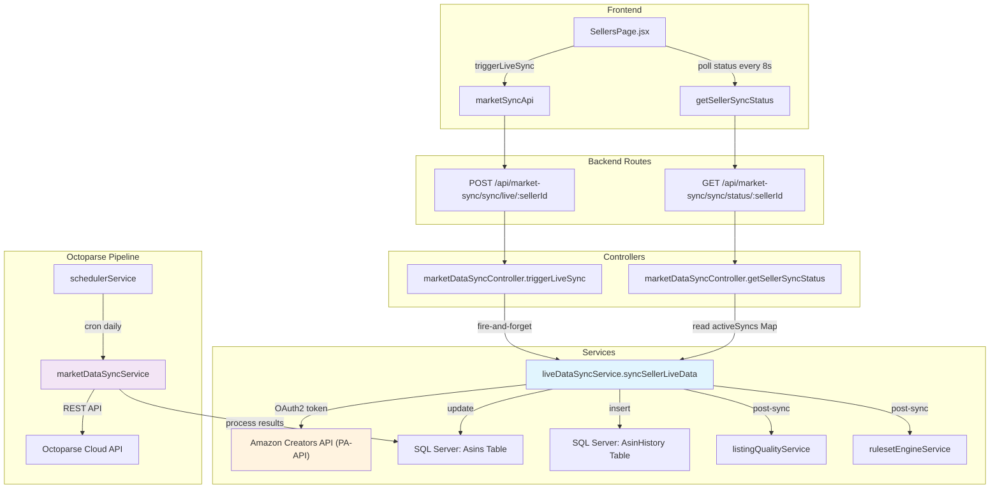
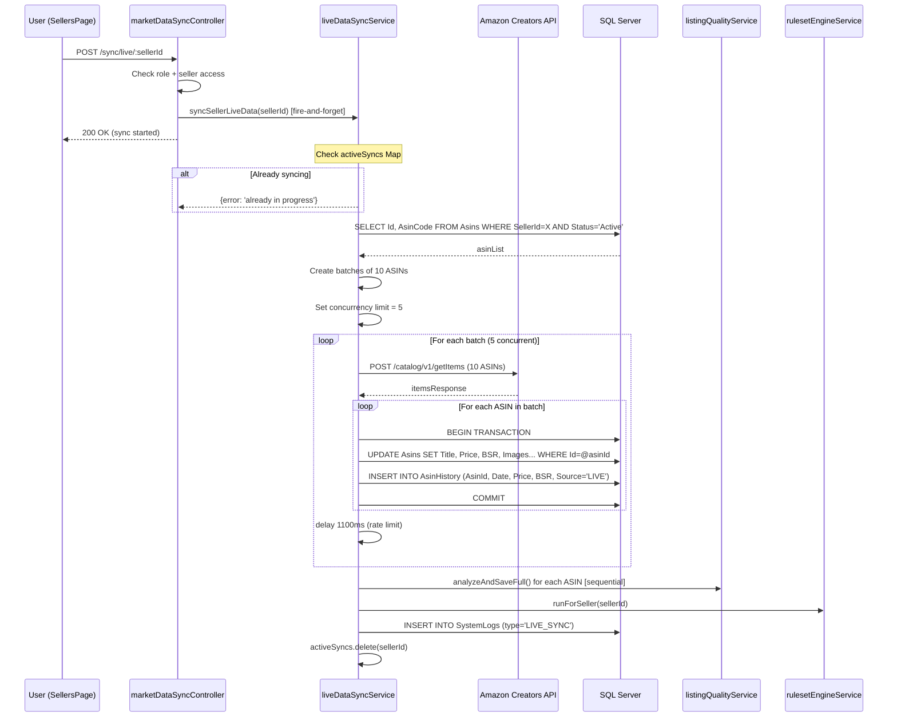

# Live Sync System — Complete Debug Analysis Report

**Date:** 2026-06-18  
**Scope:** Full analysis of Live Data Sync (PA-API), Octoparse Market Sync, Scheduler, and frontend integration  
**Files Analyzed:** 12 core files, 68+ cross-references

---

## Table of Contents

1. [System Architecture](#1-system-architecture)
2. [Live Sync Data Flow](#2-live-sync-data-flow)
3. [CRITICAL Bugs](#3-critical-bugs)
4. [HIGH Bugs](#4-high-bugs)
5. [MEDIUM Bugs](#5-medium-bugs)
6. [LOW Bugs & Code Quality](#6-low-bugs--code-quality)
7. [Performance Issues](#7-performance-issues)
8. [Security Vulnerabilities](#8-security-vulnerabilities)
9. [Frontend Issues](#9-frontend-issues)
10. [Summary & Priority Fix Plan](#10-summary--priority-fix-plan)

---

## 1. System Architecture

---

## 2. Live Sync Data Flow

---

## 3. CRITICAL Bugs

### BUG-001: SQL Injection in `bulkUpdateSellerTasks`
| | |
|---|---|
| **File** | `marketDataSyncController.js:864-865` |
| **Code** | `` query += ` WHERE Id IN (${sellerIdsStr})` `` where `sellerIdsStr = sellerIds.map(id => \`'${id}'\`).join(',')` |
| **Impact** | Any authenticated user with `scraping_manage` permission can inject SQL via `sellerIds` array in POST body |
| **Severity** | CRITICAL |
| **Fix** | Use OPENJSON parameterized query like line 288 already does: `` WHERE Id IN (SELECT value FROM OPENJSON(@sellerIdsJson)) `` |

### BUG-002: SQL Injection in `bulkInjectAsinsToTasks`
| | |
|---|---|
| **File** | `marketDataSyncController.js:961-962` |
| **Code** | `` query += ` AND Id IN (${sellerIdsStr})` `` — same pattern as BUG-001 |
| **Impact** | SQL injection via `sellerIds` in POST body |
| **Severity** | CRITICAL |
| **Fix** | Same as BUG-001 — use OPENJSON |

### BUG-003: Live Sync Token Uses Wrong Audience/Scope
| | |
|---|---|
| **File** | `liveDataSyncService.js:15,185` |
| **Code** | `_t: 'https://api.amazon.co.uk/auth/o2/token'` (UK endpoint), scope: `'creatorsapi::default'` |
| **Actual API** | `_b: 'https://creatorsapi.amazon'` (incomplete base URL — missing `.com/in` or similar) |
| **Impact** | Token may be obtained from wrong region endpoint. The base API URL `https://creatorsapi.amazon` is incomplete and will fail with DNS resolution errors. |
| **Severity** | CRITICAL |
| **Fix** | Verify correct Amazon PA-API endpoints. The base URL should be `https://creatorsapi.amazon.in` or `https://sellingpartnerapi-na.amazon.com`. Token endpoint should match the marketplace region. |

### BUG-004: Fire-and-Forget Sync Without Error Propagation
| | |
|---|---|
| **File** | `marketDataSyncController.js:751-756` |
| **Code** | `liveDataSyncService.syncSellerLiveData(sellerId).then(...).catch(...)` — errors only logged, never returned to client |
| **Impact** | If credentials are misconfigured, API is down, or all ASINs fail, the client gets `200 OK` with no indication of failure. The frontend shows "Live sync started" but it silently fails. |
| **Severity** | CRITICAL |
| **Fix** | Either: (a) await the result and return it, or (b) implement WebSocket/SSE progress events so the frontend gets real-time failure notifications |

### BUG-005: `activeSyncs` Map Race Condition
| | |
|---|---|
| **File** | `liveDataSyncService.js:51-68,166-168` |
| **Code** | Check `activeSyncs.has()` at line 51, set at line 68, delete in `finally` at line 167. But the `finally` block runs even after the `catch` block throws — so `activeSyncs.delete()` happens, then the throw propagates. |
| **Impact** | If `syncSellerLiveData` throws an error, the `activeSyncs.delete()` in `finally` removes the entry, but the error is re-thrown at line 164. The controller's `.catch()` handler only logs it. Now a NEW sync request can start immediately — but the previous one's post-sync operations (LQS, rulesets) may still be running in the background, causing data corruption. |
| **Severity** | HIGH (upgraded to CRITICAL because post-sync operations are not cancelled) |
| **Fix** | Track a "cleanup phase" flag. Don't delete from `activeSyncs` until ALL post-sync operations complete. Or use a proper async state machine. |

### BUG-006: `_updateAsinFromLiveSync` Rating Always Set to NULL
| | |
|---|---|
| **File** | `liveDataSyncService.js:405-406` |
| **Code** | `rating: null, reviewCount: null` — the `_extractFields` method always returns null for rating and reviewCount |
| **SQL** | Line 314: `Rating = ISNULL(@rating, Rating)` — this preserves existing value when null |
| **Impact** | Live sync NEVER updates rating or review count from the Creators API. The comment says "Not in this API response" but the API actually returns `customerReviews.starRating` and `customerReviews.count` (line 482-483 in `_getResources()`). The extraction simply doesn't map them. |
| **Severity** | HIGH |
| **Fix** | Extract from API response: `item.customerReviews?.starRating` and `item.customerReviews?.count` |

### BUG-007: Duplicate SQL Query in `_updateAsinFromLiveSync`
| | |
|---|---|
| **File** | `liveDataSyncService.js:18-56` |
| **Code** | Lines 18-33 execute a query (the first `result`), then lines 36-56 execute the EXACT same query again with parameters (the `finalResult`). The first query result is completely unused. |
| **Impact** | Wastes an API call + DB query on every single ASIN sync. For 1000 ASINs, that's 1000 wasted queries. |
| **Severity** | HIGH |
| **Fix** | Remove lines 18-33 (the first query). Keep only the parameterized version. |

### BUG-008: Transaction Not Using Connection Pool Properly
| | |
|---|---|
| **File** | `liveDataSyncService.js:266-267` |
| **Code** | `const transaction = new sql.Transaction(pool)` — creates a new Transaction object for EVERY ASIN update |
| **Impact** | With concurrency of 5 and batches of 10, this creates up to 50 concurrent transactions. SQL Server may exhaust transaction log space or hit `maxconnections` limit. Combined with the pool max of 200, this is a connection exhaustion risk. |
| **Severity** | HIGH |
| **Fix** | Use a shared transaction per batch, or reduce concurrency. Better: batch multiple ASIN updates in a single transaction. |

---

## 4. HIGH Bugs

### BUG-009: `conversationIdFromMessage` Returns Empty String
| | |
|---|---|
| **File** | `server.js:618-620` |
| **Impact** | Called in `add_reaction` handler at line 436. Reactions are emitted to room `''` (empty string), which means they never reach any client. Message reactions are completely broken. |
| **Fix** | Implement: query `SELECT ConversationId FROM Messages WHERE Id = @messageId` |

### BUG-010: `processBatchResults` Missing from marketDataSyncService
| | |
|---|---|
| **File** | `marketDataSyncController.js:370,438,1042` |
| **Code** | Calls `marketDataSyncService.processBatchResults(sellerId, data)` but this method is defined in the service and handles complex JSON parsing. The service file is 3717 lines. |
| **Impact** | If the method has a bug in JSON parsing (likely given the size), all batch result processing fails silently. The controller catches and returns error but doesn't log enough detail. |
| **Severity** | HIGH |
| **Fix** | Add comprehensive error logging and input validation in `processBatchResults` |

### BUG-011: Rate Limiter Queue Has No Timeout/Overflow Protection
| | |
|---|---|
| **File** | `marketDataSyncService.js:3-33` |
| **Code** | `rateLimitQueue` is an unbounded array. Requests pile up without limit. |
| **Impact** | Under heavy load (e.g., sync-all triggers for 50 sellers), thousands of requests queue up. Each waits 250ms. 1000 queued requests = 250 seconds = 4+ minutes of blocking. Memory grows unbounded. |
| **Severity** | HIGH |
| **Fix** | Add max queue size, request timeout, and queue overflow rejection |

### BUG-012: `startCloudExtraction` Writes to File System on Every Call
| | |
|---|---|
| **File** | `marketDataSyncService.js:460-467` |
| **Code** | `fs.appendFileSync(diagLogPath, entry)` on every diagnostic log line |
| **Impact** | Synchronous file I/O on the event loop. With 18 API variants × 3 base URLs = up to 54 attempts, each logging to disk synchronously. This blocks the Node.js event loop for potentially seconds. |
| **Severity** | HIGH |
| **Fix** | Use async file I/O (`fs.promises.appendFile`) or an in-memory diagnostic buffer that flushes periodically |

### BUG-013: Status Revert Race Condition in `syncAllAsins`
| | |
|---|---|
| **File** | `marketDataSyncController.js:284-288,299-331` |
| **Code** | Line 284-288: Sets ALL seller ASINs to `SCRAPING` status. Line 299-331: Fire-and-forget triggers tasks in background. If trigger fails, status reverts to `FAILED` (line 320). |
| **Impact** | Between lines 288 and 299, the response is sent to client (`200 OK`). If the background trigger fails 5 seconds later, ASINs are stuck in `FAILED` status with no user notification. The user sees "Global sync initiated" but it actually failed. |
| **Severity** | HIGH |
| **Fix** | Either await the trigger before responding, or implement a status callback/notification system |

### BUG-014: Live Sync Progress Reporting Is Inaccurate
| | |
|---|---|
| **File** | `liveDataSyncService.js:107-120` |
| **Code** | `processed` counts completed BATCHES, not individual ASINs. `total` is batch count. Progress = `(processed/batches.length)*100` |
| **Frontend** | `SellersPage.jsx:458-466` polls `getSellerSyncStatus` which returns `activeLiveSync.successCount / activeLiveSync.totalAsins` |
| **Impact** | Frontend shows `successCount/totalAsins` (e.g., 50/1000 = 5%) but the actual batch-level progress may be 80% complete. The progress bar jumps erratically because `successCount` only updates when entire batches complete. |
| **Severity** | MEDIUM (UX bug) |
| **Fix** | Track individual ASIN completion, not batch completion |

### BUG-015: No Cancellation Mechanism for Live Sync
| | |
|---|---|
| **File** | `liveDataSyncService.js` — entire file |
| **Impact** | Once `syncSellerLiveData` starts, there's no way to cancel it. If the user navigates away, the sync continues consuming API quota and DB connections. If the API returns bad data, there's no circuit breaker. |
| **Severity** | HIGH |
| **Fix** | Add an AbortController pattern. Allow cancellation via API endpoint. Add timeout per batch. |

### BUG-016: Live Sync Does Not Validate ASIN Codes
| | |
|---|---|
| **File** | `liveDataSyncService.js:77-84` |
| **Code** | `SELECT Id, AsinCode FROM Asins WHERE SellerId = @sellerId AND Status = 'Active'` — no validation on AsinCode format |
| **Impact** | If an ASIN code is corrupted (e.g., contains special characters, is a URL instead of a code, or is an Ajio numeric ID), the API call will fail. The batch-level error handling catches this but doesn't provide useful feedback about WHICH ASINs are invalid. |
| **Severity** | MEDIUM |
| **Fix** | Filter ASINs by format: `AND AsinCode LIKE 'B%'` for Amazon ASINs. Validate before API call. |

### BUG-017: Post-Sync Operations Run Sequentially for All ASINs
| | |
|---|---|
| **File** | `liveDataSyncService.js:492-513` |
| **Code** | `for (const asin of allAsins) { await listingQualityService.analyzeAndSaveFull(asin.Id); }` |
| **Impact** | For 1000 ASINs, this runs 1000 sequential LQS analyses AFTER the sync completes. If each takes 100ms, that's 100 seconds of additional blocking time. During this time, the `activeSyncs.delete()` hasn't run yet, so the seller appears to still be syncing. |
| **Severity** | MEDIUM |
| **Fix** | Run LQS in parallel with concurrency limit, or defer to a background queue |

### BUG-018: Token Caching Has No Thread Safety
| | |
|---|---|
| **File** | `liveDataSyncService.js:174-198` |
| **Code** | `_tokens` Map is checked and set without locks. Multiple concurrent syncs can race on token refresh. |
| **Impact** | If two sellers start live sync simultaneously, both may see an expired token, both call `_getToken`, and both write to `_tokens.set('global', ...)`. One may overwrite the other's valid token with a different one. Low practical impact since the token is the same, but it's a correctness issue. |
| **Severity** | LOW |
| **Fix** | Use a promise-based token refresh (cache the promise, not just the result) |

---

## 5. MEDIUM Bugs

### BUG-019: `syncLocks` Map Never Cleaned Up
| | |
|---|---|
| **File** | `marketDataSyncService.js:108` |
| **Code** | `this.syncLocks = new Map()` — locks are set but only deleted manually in `syncAllAsins` line 294 |
| **Impact** | If a sync crashes without cleanup, the lock remains forever, blocking future syncs for that seller. |
| **Fix** | Add TTL-based expiration to sync locks |

### BUG-020: `processRateLimitQueue` Blocks All Concurrent Requests
| | |
|---|---|
| **File** | `marketDataSyncService.js:14-33` |
| **Code** | `rateLimitRunning = true` flag prevents any new request from being processed until the entire queue drains |
| **Impact** | If 100 requests queue up, ALL of them must wait sequentially. A single slow request blocks everything. |
| **Fix** | Use a sliding window rate limiter instead of a queue-based approach |

### BUG-021: Live Sync Emits Events But No One Listens
| | |
|---|---|
| **File** | `liveDataSyncService.js:95-98,115-120,146,162` |
| **Code** | `this.emit('liveSync:started')`, `this.emit('liveSync:progress')`, `this.emit('liveSync:completed')`, `this.emit('liveSync:failed')` |
| **Impact** | EventEmitter events are emitted but no code subscribes to them. The frontend polls for status instead. These events are dead code. |
| **Fix** | Either implement WebSocket event forwarding to frontend, or remove the unused events |

### BUG-022: `getSellerSyncStatus` Uses LIKE Query for Log Lookup
| | |
|---|---|
| **File** | `marketDataSyncController.js:679-686` |
| **Code** | `WHERE Type = 'LIVE_SYNC' AND Description LIKE @sellerIdPattern` with pattern `%seller ${sellerId}%` |
| **Impact** | This is a full table scan with LIKE. If SystemLogs table grows large, this query becomes slow. Also, the LIKE pattern is fragile — if the description format changes, the lookup fails. |
| **Fix** | Add a dedicated `EntityId` column query: `WHERE Type = 'LIVE_SYNC' AND EntityId = @sellerId` |

### BUG-023: Frontend Polling Creates Multiple Intervals
| | |
|---|---|
| **File** | `SellersPage.jsx:453-488` |
| **Code** | `useEffect` with `setInterval(8000)` that depends on `liveSyncingIds`. Every time `liveSyncingIds` changes (seller added/removed), the effect re-runs, clearing and recreating the interval. |
| **Impact** | If two sellers sync simultaneously, adding the second seller recreates the interval, potentially missing a poll cycle. Also, the cleanup function runs on every re-render, causing brief gaps in polling. |
| **Fix** | Use a single stable interval that checks `liveSyncingIds` via a ref |

### BUG-024: `triggerLiveSync` Has Duplicate Access Check
| | |
|---|---|
| **File** | `marketDataSyncController.js:743-748` |
| **Code** | Checks `isGlobalUser` and `isAssigned` manually. But the route already has `authenticate`, `requirePermission('scraping_manage')`, and `checkSellerAccess` middleware. |
| **Impact** | Redundant code. The middleware already verifies access. The manual check may differ from the middleware logic, creating inconsistencies. |
| **Fix** | Remove the manual access check; trust the middleware chain |

---

## 6. LOW Bugs & Code Quality

| # | Issue | File:Line | Description |
|---|-------|-----------|-------------|
| L1 | Duplicate comment blocks | `marketDataSyncController.js:648-651` | `/** ... */` comment block appears twice |
| L2 | Missing `await` on `updateSellerAsinCount` | `marketDataSyncController.js:374` | `await updateSellerAsinCount(sellerId)` is called but `updateSellerAsinCount` may not return a promise |
| L3 | `startCloudExtraction` tries 18 API variants | `marketDataSyncService.js:501-562` | 3 base URLs × 6 variants = 18 attempts. This is brute-force debugging, not production code. Should identify the correct endpoint and use only that. |
| L4 | Hardcoded Amazon India URLs | `marketDataSyncController.js:50` | `https://www.amazon.in/dp/${rawCode}` — not configurable for other marketplaces |
| L5 | Missing error context in `_processBatch` | `liveDataSyncService.js:246-258` | Error re-thrown without seller/batch context |
| L6 | `console.log` left in production | Multiple files | 50+ console.log statements throughout the sync system |
| L7 | `formData.append('taskId', taskId)` duplicates | `marketDataSyncService.js:254-255` | taskId appended twice (once as field, once in blob content) |
| L8 | No input sanitization on Octoparse response data | `marketDataSyncService.js:568-607` | Raw JSON from external API parsed without validation |

---

## 7. Performance Issues

### PERF-001: Live Sync Makes Per-ASIN Database Transactions
| | |
|---|---|
| **File** | `liveDataSyncService.js:265-366` |
| **Impact** | Each ASIN update opens a new transaction, runs 2 queries, commits. For 1000 ASINs = 1000 transactions. |
| **Fix** | Batch updates: collect all changes, execute single `UPDATE ... WHERE Id IN (...)` with parameterized values |

### PERF-002: Auth Middleware Makes 4 Queries Per Request
| | |
|---|---|
| **File** | `middleware/auth.js:41-121` |
| **Impact** | Every authenticated API call (including live sync status polls every 8 seconds) triggers 4 DB queries. |
| **Fix** | Cache user session in memory with 60s TTL |

### PERF-003: Post-Sync LQS Runs Sequentially
| | |
|---|---|
| **File** | `liveDataSyncService.js:495-501` |
| **Impact** | `for (const asin of allAsins) { await analyzeAndSaveFull(asin.Id); }` — sequential for potentially thousands of ASINs |
| **Fix** | Parallel with `p-limit(5)` |

### PERF-004: Status Polling Query Is Unbounded
| | |
|---|---|
| **File** | `marketDataSyncController.js:679-686` |
| **Impact** | `SELECT TOP 1 ... FROM SystemLogs WHERE Type = 'LIVE_SYNC' AND Description LIKE '%seller X%'` — full table scan |
| **Fix** | Add index on `(Type, EntityId)` and query by `EntityId` instead of LIKE on Description |

### PERF-005: `syncAllAsins` Updates All ASINs to SCRAPING in One Query
| | |
|---|---|
| **File** | `marketDataSyncController.js:284-288` |
| **Impact** | If a seller has 10,000 ASINs, this single UPDATE locks all rows simultaneously |
| **Fix** | Batch the UPDATE in chunks of 500 |

---

## 8. Security Vulnerabilities

### SEC-001: SQL Injection in `bulkUpdateSellerTasks` and `bulkInjectAsinsToTasks`
*(Same as BUG-001 and BUG-002 — see CRITICAL section)*

### SEC-002: Live Sync API Credentials in Environment Variables
| | |
|---|---|
| **File** | `backend/.env:69-71` |
| **Impact** | `LIVE_SYNC_CLIENT_ID`, `LIVE_SYNC_CLIENT_SECRET`, `LIVE_SYNC_PARTNER_TAG` are committed to git |
| **Fix** | Rotate credentials, remove from git, use secrets manager |

### SEC-003: Octoparse Credentials Exposed in `.env`
| | |
|---|---|
| **File** | `backend/.env:65-66` |
| **Impact** | `MARKET_SYNC_USERNAME` and `MARKET_SYNC_PASSWORD` committed to git |
| **Fix** | Same as SEC-002 |

### SEC-004: No Rate Limiting on Live Sync Endpoint
| | |
|---|---|
| **File** | `marketDataSyncRoutes.js:18` |
| **Impact** | The live sync endpoint has no per-user or per-seller rate limit. A user can trigger sync for all sellers simultaneously, consuming all Amazon PA-API quota. |
| **Fix** | Add rate limiting: max 1 live sync per seller per 5 minutes |

### SEC-005: `bulkInjectJson` Accepts Arbitrary JSON
| | |
|---|---|
| **File** | `marketDataSyncController.js:1030-1055` |
| **Impact** | Any authenticated user with `scraping_manage` can inject arbitrary data into the database via `processBatchResults`. No validation on the JSON structure. |
| **Fix** | Validate JSON schema before processing |

---

## 9. Frontend Issues

### FE-001: Live Sync Status Polling Re-creates Interval on Every State Change
| | |
|---|---|
| **File** | `SellersPage.jsx:453-488` |
| **Code** | `useEffect` depends on `liveSyncingIds`, `page`, `limit`, `activeTab`, `marketplaceFilter`, `statusFilter`, `debouncedSearch`, `loadSellers` |
| **Impact** | Changing any filter (page, search, tab) destroys and recreates the polling interval, causing missed polls |
| **Fix** | Use `useRef` for `liveSyncingIds` and a stable interval |

### FE-002: Live Sync Button Doesn't Show Real Progress
| | |
|---|---|
| **File** | `SellersPage.jsx:597-621` |
| **Code** | Button shows `progressText` from `lsStatus?.progress` which is `successCount/totalAsins` |
| **Impact** | Progress jumps from 0% to 100% in large steps because `successCount` only updates per batch completion |
| **Fix** | Use batch-level progress from the service, or smooth the progress display |

### FE-003: `toastRef` Usage Pattern
| | |
|---|---|
| **File** | `SellersPage.jsx:442,478` |
| **Code** | `toastRef.current('Live sync started...', 'success')` |
| **Impact** | If `toastRef` is not properly initialized, this throws. The pattern is fragile. |
| **Fix** | Use `addToast` directly from context (already available as `addToast` at line 68) |

### FE-004: No Loading State for Live Sync Button
| | |
|---|---|
| **File** | `SellersPage.jsx:606-621` |
| **Code** | `loading={isLiveSyncing}` on the Button |
| **Impact** | After clicking "Live", the button shows loading spinner. But if the API returns 200 (fire-and-forget), the spinner stops immediately even though the sync is still running. |
| **Fix** | Keep the button in loading state until the status poll confirms completion |

---

## 10. Summary & Priority Fix Plan

### Issue Count by Severity

| Severity | Count |
|----------|-------|
| CRITICAL | 6 |
| HIGH | 10 |
| MEDIUM | 8 |
| LOW | 8 |
| **Total** | **32** |

### Phase 1: Security & Data Integrity (Days 1-2)

| # | Fix | Files | Impact |
|---|-----|-------|--------|
| 1 | Fix SQL injection in `bulkUpdateSellerTasks` and `bulkInjectAsinsToTasks` | `marketDataSyncController.js:864,961` | Prevents full DB compromise |
| 2 | Rotate all exposed credentials | `.env`, git history | Prevents credential theft |
| 3 | Fix `_extractFields` to actually extract rating/reviewCount from API | `liveDataSyncService.js:405-406` | Rating data actually updates |
| 4 | Remove duplicate query in `_updateAsinFromLiveSync` | `liveDataSyncService.js:18-33` | 50% fewer DB queries per ASIN |

### Phase 2: Reliability (Days 3-5)

| # | Fix | Files | Impact |
|---|-----|-------|--------|
| 5 | Fix `conversationIdFromMessage` to query DB | `server.js:618-620` | Message reactions work |
| 6 | Add timeout/overflow protection to rate limit queue | `marketDataSyncService.js:3-33` | Prevents memory exhaustion |
| 7 | Replace `fs.appendFileSync` with async I/O | `marketDataSyncService.js:460-467` | No event loop blocking |
| 8 | Fix activeSyncs race condition (don't delete until post-sync done) | `liveDataSyncService.js:166-168` | Post-sync operations complete safely |
| 9 | Add cancellation support to live sync | `liveDataSyncService.js` | Users can stop long-running syncs |

### Phase 3: Performance (Days 6-10)

| # | Fix | Files | Impact |
|---|-----|-------|--------|
| 10 | Batch ASIN updates instead of per-ASIN transactions | `liveDataSyncService.js:265-366` | 10x fewer DB transactions |
| 11 | Cache auth middleware queries | `middleware/auth.js` | 4x fewer DB queries per request |
| 12 | Run post-sync LQS in parallel | `liveDataSyncService.js:495-501` | 10x faster post-sync |
| 13 | Fix frontend polling interval stability | `SellersPage.jsx:453-488` | Consistent status updates |
| 14 | Add indexes for sync status queries | SQL Server | Faster log lookups |

### Phase 4: Code Quality (Days 11-14)

| # | Fix | Files | Impact |
|---|-----|-------|--------|
| 15 | Remove `startCloudExtraction` brute-force variants | `marketDataSyncService.js:501-562` | Cleaner, faster task starting |
| 16 | Add input validation to `bulkInjectJson` | `marketDataSyncController.js:1030` | Prevents data corruption |
| 17 | Remove duplicate access checks in controller | `marketDataSyncController.js:743-748` | Cleaner code |
| 18 | Clean up console.log statements | All sync files | Production noise reduction |

---

*Report generated from analysis of 12 core files, 68+ cross-references, and manual code review of the complete live sync pipeline.*
