# RetailOps V2.1 Module Workflows Design & Architecture

Welcome to the comprehensive workflow design and visual diagram documentation for **RetailOps V2.1** (Growth Management System). This guide maps the end-to-end journey from user login, session initialization, and dashboard rendering, down to every specific sub-system operational flow.

---

## 1. Master Flow: End-to-End User Journey

This flowchart traces the user journey from authentication, through the onboarding and router checks, into the major functional nodes of the platform.

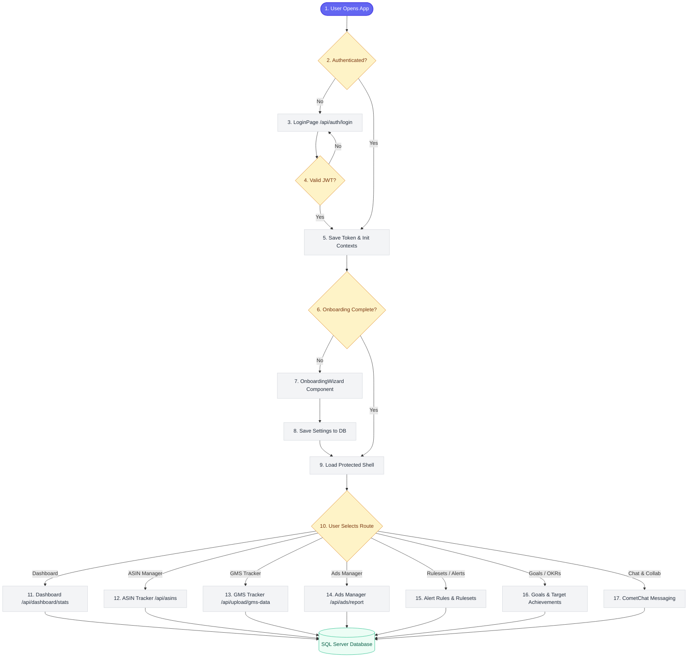

---

## 2. Step 1: Login, Session Initialization & RBAC Bootstrapping

This sequence detail shows the handshake between the login inputs, token signature, role extraction, client context configurations, and redirect routes.

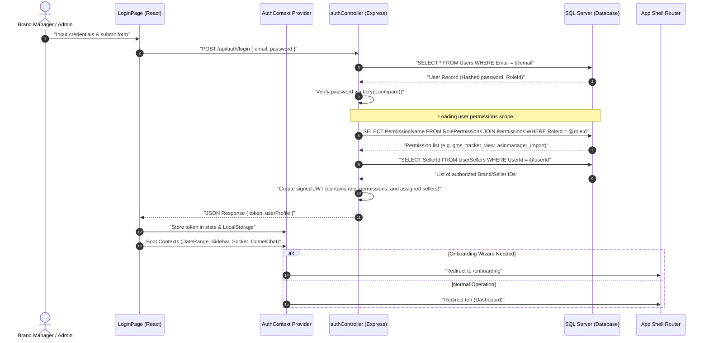

---

## 3. Step 2: Dashboard Rendering & Multi-Tenant Scoping

Once authenticated, this flow explains how user privileges filter raw metrics to render KPIs.

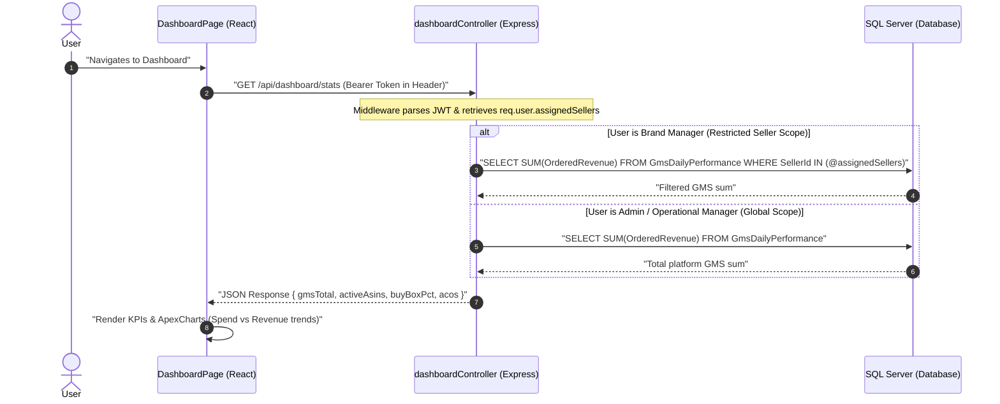

---

## 4. Step 3: ASIN Tracking, History & Price Disputes

This workflow details catalog listing lookups, detail graphing, and price variance triggers.

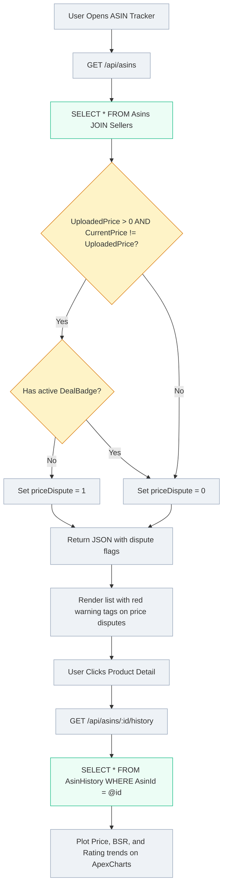

---

## 5. Step 4: GMS Day-over-Day Tracker Ingestion & Trend Matrix

Explains how spreadsheets are processed, verified, and mapped onto a calendar trend grid.

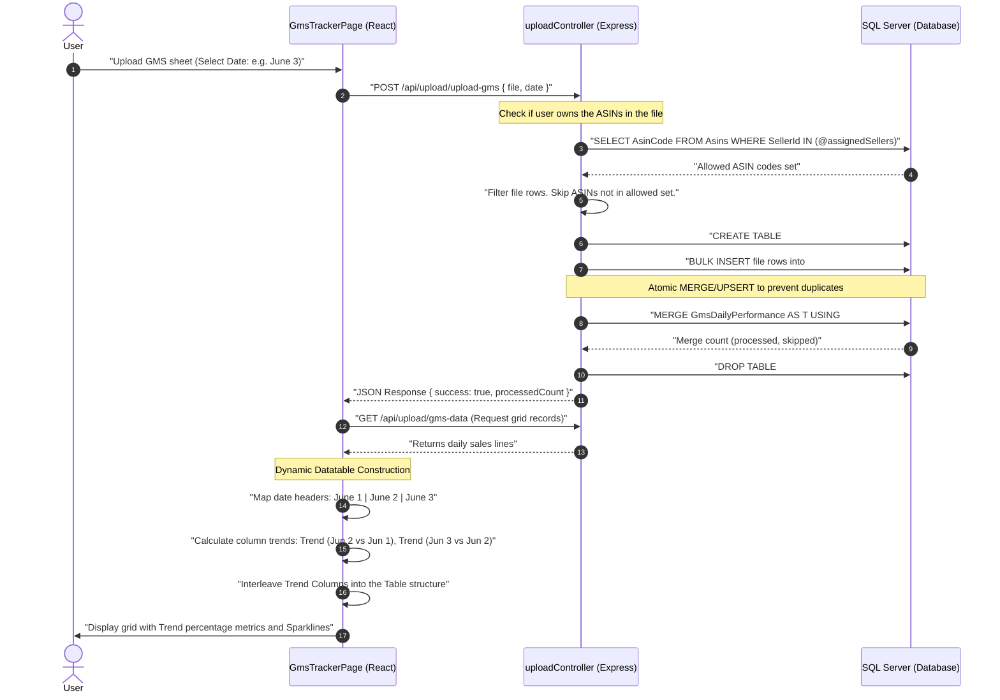

---

## 6. Step 5: Ads Performance & Campaign Analytics

How campaign metrics are parsed and rendered with sticky navigation columns to prevent layout overlapping.

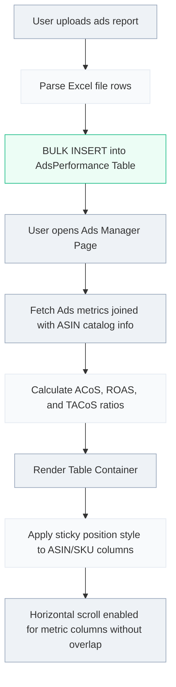

---

## 7. Step 6: Octoparse Scraper Automation & Data Sync Pipeline

This diagram shows the scraping loop, from URL file injection, cloud scraper execution, quad-hourly polling, and memory-safe regex DOM parsing.

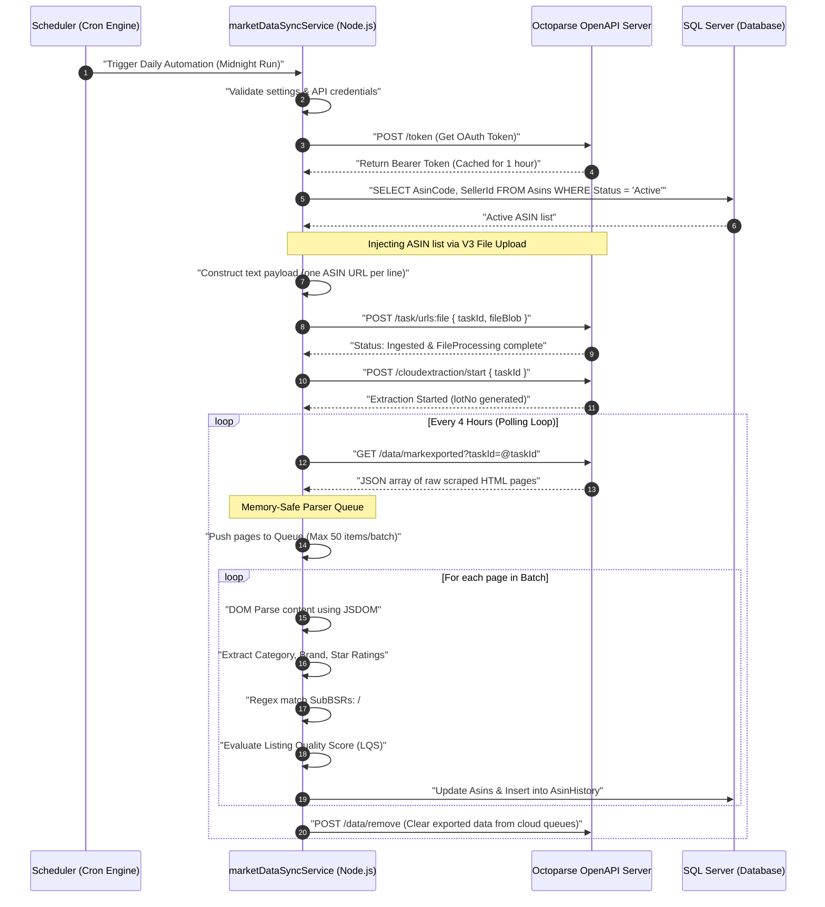

---

## 8. Step 7: Goal Management, OKRs & Perplexity AI Decomposition

The workflow details OKR tracking and how high-level goals decompose into action checklists using AI prompts.

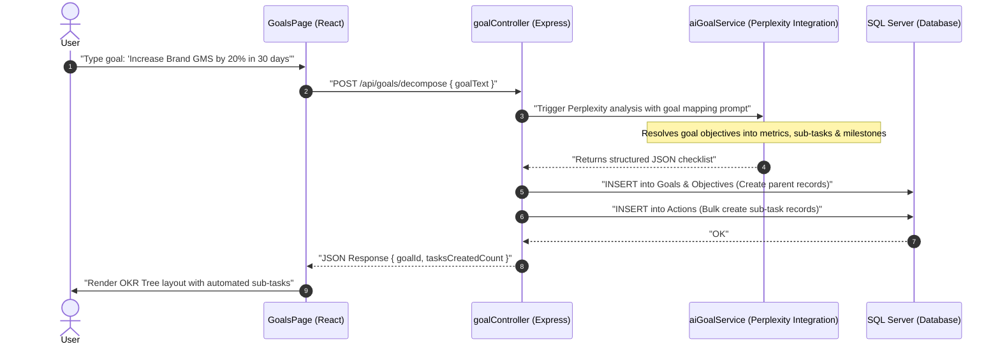

---

## 9. Step 8: Ruleset Engine & Alert Dispatcher

This diagram maps rule evaluation pipelines to create notifications, logs, and outgoing webhooks.

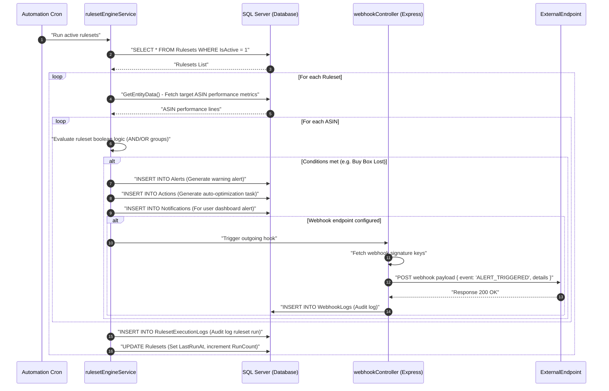

---

## 10. Step 9: margins Calculator & FBA Fees

How parameters map to calculate profit margins.

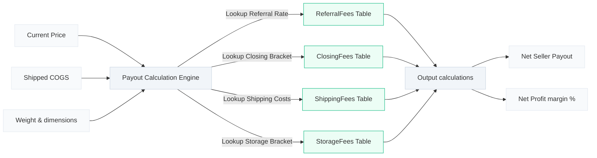

---

## 11. Step 10: Collaboration Chat & Channels

Shows real-time workspace chat room messaging loops.

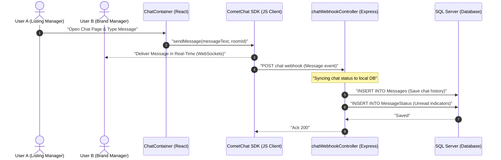

---
*Document Version: 2.1.0*  
*Last Updated: 2026-06-16*
