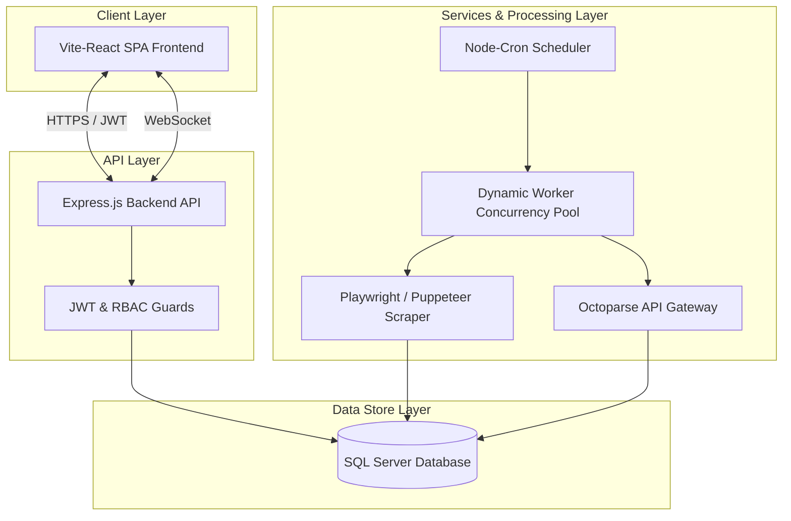
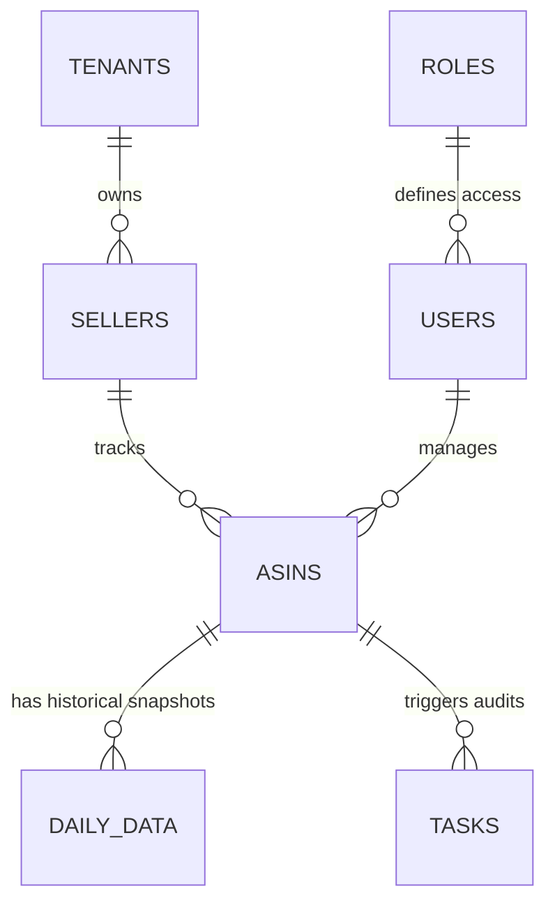

# System Architecture & Technical Overview

## Table of Contents
1. [Introduction](#introduction)
2. [High-Level Architecture](#high-level-architecture)
3. [Technology Stack](#technology-stack)
4. [Component Integration Flow](#component-integration-flow)
5. [Core Entities & Relationship Map](#core-entities--relationship-map)

---

## Introduction
**RetailOps / DataMiner** is a premium e-commerce intelligence SaaS platform designed for multi-platform retail operations. It combines automated web scrapers, ASIN/listing tracking, dynamic pricing rules, Listing Quality Score (LQS) metrics, and task collaboration to empower brands and operational teams.

---

## High-Level Architecture

The platform uses a layered services architecture optimized for reliability, data safety, and real-time synchronization.

---

## Technology Stack

### 1. Frontend
* **Core**: React 19, Vite (Fast HMR & build optimization), TypeScript.
* **UI/UX**: Custom premium stylesheets, Tailwind CSS, Lucide React Icons.
* **State Management**: Zustand (lightweight stores), Context API.
* **Routing**: React Router DOM v7 (protected routes with RBAC).
* **Charts/Analytics**: ApexCharts, Recharts, Chart.js for data visualization.

### 2. Backend
* **Runtime**: Node.js (V8) configured for optimal memory usage (`--max-old-space-size=4096`).
* **Framework**: Express.js (Modular Router architecture).
* **Database Driver**: `mssql` for native connection pooling with SQL Server.
* **Real-time**: Socket.IO for live scraping logs and task progress streams.

### 3. Scraping & Pipeline
* **Direct Scraper**: Playwright and Puppeteer with Stealth plugins.
* **External Scraper**: Octoparse Integration via automated JSON API endpoints.
* **Scheduling**: `node-cron` orchestrating background pipeline jobs.

---

## Component Integration Flow

The system flows through three primary loops:
1. **The Configuration Loop**: Admins define Sellers, Roles, and Rulesets.
2. **The Ingestion/Scraping Loop**: Scrapers parse target marketplace pages, calculate Listing Quality Scores (LQS), and write daily snapshots.
3. **The Audit Loop**: The system evaluates rulesets on incoming listing snapshots and triggers manual task flows for disputes or pricing modifications.

---

## Core Entities & Relationship Map

