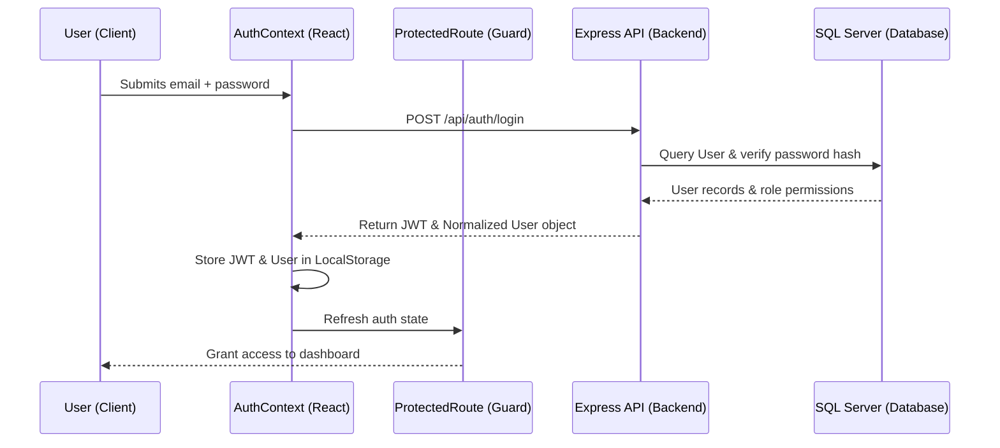

# Authentication & Authorization

## Table of Contents
1. [Overview](#overview)
2. [Workflow](#workflow)
3. [Key Files](#key-files)
4. [Role-Based Access Control (RBAC)](#role-based-access-control-rbac)
5. [API Endpoints](#api-endpoints)

---

## Overview
RetailOps utilizes a comprehensive Role-Based Access Control (RBAC) system backed by JWT authentication. User sessions are verified via signed JSON Web Tokens passed in the `Authorization` bearer header. Special roles like `super_admin` are granted full bypass permissions, while other roles are mapped to discrete granular permissions.

---

## Workflow



---

## Key Files
* **Frontend**:
  * [AuthContext.jsx](file:///Users/jenilrupapara/RetailOps_V2.1/retail-ops/src/contexts/AuthContext.jsx): Directs login/logout states, token persistence, and role-normalization (`normalizeUser`). Provides `hasPermission` utility hook.
  * [ProtectedRoute.jsx](file:///Users/jenilrupapara/RetailOps_V2.1/retail-ops/src/components/ProtectedRoute.jsx): Guards routes dynamically based on permissions rather than hardcoded role names.
* **Backend**:
  * `backend/controllers/authController.js`: Authenticates users, validates passwords using bcrypt, generates JWT.
  * `backend/middleware/auth.js`: Verifies bearer tokens and sets `req.user` details.

---

## Role-Based Access Control (RBAC)

The system normalizes and processes permission evaluations via two major guardrails:
1. **Super Admin Bypass**: Any role containing keywords `super`, `supert`, `super_admin`, or `supert admin` automatically bypasses permission arrays and is granted `true` across all `hasPermission` requests.
2. **Standard Mappings**:
   * `operational_manager`: Inherits all operational permissions except settings and user management.
   * Granular matching: Checks `user.permissions` array or matches names in `user.role.permissions`.

---

## API Endpoints

### 1. User Login
* **Method**: `POST`
* **URL**: `/api/auth/login`
* **Payload**:
  ```json
  {
    "email": "user@retailops.com",
    "password": "Password123"
  }
  ```
* **Response**:
  ```json
  {
    "success": true,
    "token": "eyJhbGciOiJIUzI1NiIsIn...",
    "user": {
      "id": 1,
      "email": "user@retailops.com",
      "role": "super_admin",
      "permissions": ["dashboard_view", "asins_view", "asins_manage"]
    }
  }
  ```
