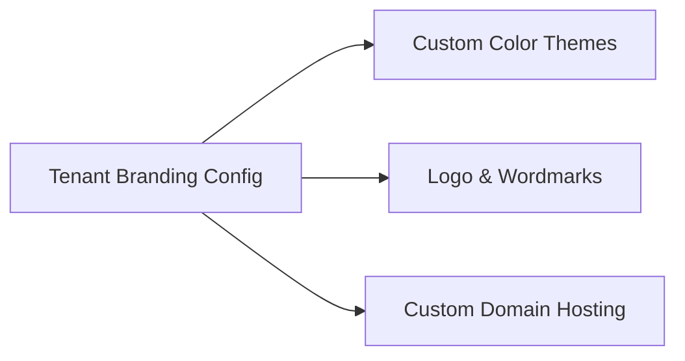

# Multi-Tenant Architecture

## Table of Contents
1. [Overview](#overview)
2. [Tenant Isolation Strategy](#tenant-isolation-strategy)
3. [White-Label Customization](#white-label-customization)
4. [Domain and Routing Rules](#domain-and-routing-rules)
5. [Database Association](#database-association)

---

## Overview
RetailOps is built with a flexible, high-fidelity multi-tenant design. It supports multiple distinct client accounts (Tenants) on a single unified deployment, offering custom branding, logos, color schemes, and completely isolated operational data pools.

---

## Tenant Isolation Strategy
Rather than using high-maintenance separate databases, the platform implements **logical row-level tenant isolation**.

* Every operational table contains a `TenantId` reference.
* All database fetch procedures automatically apply a `WHERE TenantId = @TenantId` parameter filter.
* The `TenantId` is embedded directly into each user's authenticated JWT session payload. This prevents cross-tenant access even if API payloads are altered by malicious actors.

---

## White-Label Customization

The platform features a fully-realized white-label engine enabling tenants to brand their interface:

* **Dynamic Colors**: CSS custom properties (variables) are loaded dynamically on page initialization based on the logged-in tenant's settings record.
* **Logo Injection**: Component brand logos check `tenant.logoUrl` and fall back to the default RetailOps branding.

---

## Domain and Routing Rules
Tenants can map custom subdomains (e.g., `clientname.dataminer.io`). On load, the frontend parses the host headers (`window.location.hostname`) to detect the Tenant identifier and pre-fetch branding assets before displaying the login page.

---

## Database Association

| Table Name | Partition Column | Purpose |
| :--- | :--- | :--- |
| `Tenants` | `Id` | Main tenant index and domain registration |
| `Sellers` | `TenantId` | Associated marketplace store records |
| `Asins` | `TenantId` (via Seller) | Tracked listing catalog |
| `Users` | `TenantId` | Account access mappings |
