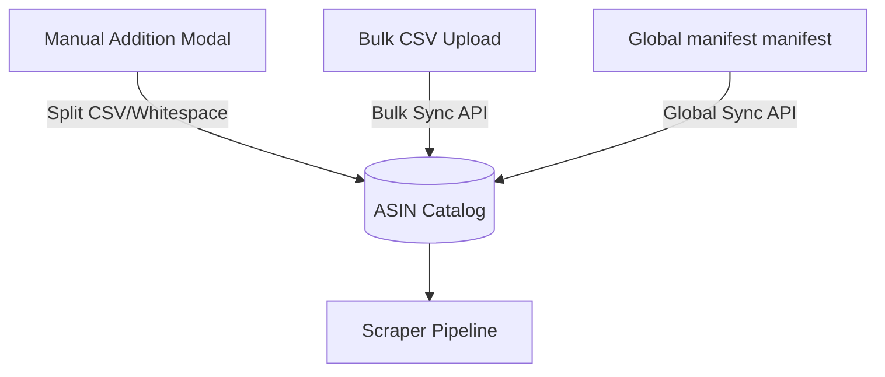

# ASIN & Jio Code Management

## Table of Contents
1. [Overview](#overview)
2. [Workflow & Operations](#workflow--operations)
3. [Key Files](#key-files)
4. [Bulk Catalog Sync & Import](#bulk-catalog-sync--import)
5. [The ASIN Manager Table](#the-asin-manager-table)

---

## Overview
The **ASIN Manager** acts as the central hub of RetailOps. It manages all tracked listings (ASINs for Amazon, Jio Codes for AJIO), their baseline tracking configurations, target sellers, and direct operational overrides (such as baseline price limits and manual rulesets).

---

## Workflow & Operations

### 1. Manual Creation
Users click `Add ASIN` to paste raw lists of space- or comma-separated ASIN codes directly. These codes are associated with a selected seller and stored instantly in the tracking pool.

### 2. Deletion and Cleanup
Users can select individual or multiple ASINs and perform batch deletions, clearing historical daily snapshots or simply removing them from active scraping jobs.

---

## Key Files
* **Frontend**:
  * [AsinManagerPage.jsx](file:///Users/jenilrupapara/RetailOps_V2.1/retail-ops/src/pages/AsinManagerPage.jsx): Holds the main table, KPI strips, search bars, and triggers for manual tasks, rulesets, and disputes.
  * [BulkImportModal.jsx](file:///Users/jenilrupapara/RetailOps_V2.1/retail-ops/src/components/asins/BulkImportModal.jsx): Handles Excel/CSV parses for Catalog Sync, Tags Import, and Global Manifests.
* **Backend**:
  * `backend/controllers/asinController.js`: Direct CRUD endpoints for active listing associations.

---

## Bulk Catalog Sync & Import
The bulk loader processes files across three dynamic tabs:
1. **Catalog Sync**: Matches or updates existing ASINs. Required columns: `ASIN, Price, SKU, Parent ASIN, Release Date`.
2. **Tags Import**: Appends customized tags to matching ASIN identifiers.
3. **Global Upload**: Maps rows containing custom seller designations to their matching listing code.

---

## The ASIN Manager Table

The table offers complex, high-performance data manipulation including:
* **Real-time Filters**: Filter by Marketplace, Seller, Status, LQS Range, or Custom Tags.
* **Inline Actions**: View Trend Graphs, update baseline Prices, start ad-hoc reviews, or trigger a repair on corrupted data parameters.
