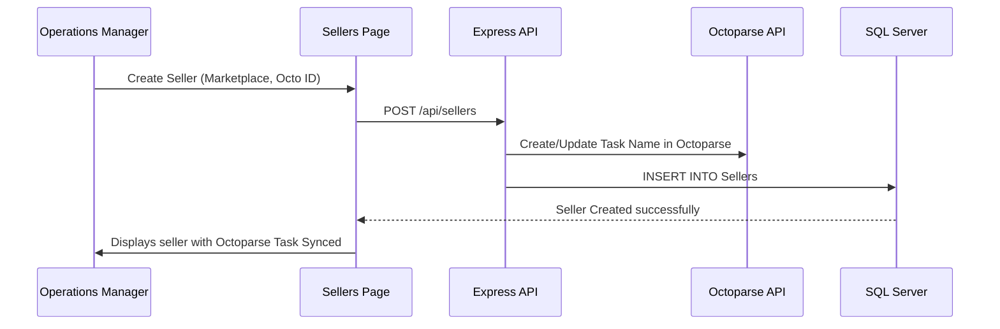

# Seller & Store Management

## Table of Contents
1. [Overview](#overview)
2. [Workflow](#workflow)
3. [Key Files](#key-files)
4. [Scraping & Credentials Configuration](#scraping--credentials-configuration)
5. [Database Mappings](#database-mappings)

---

## Overview
The **Sellers & Stores** module houses individual e-commerce seller credentials, marketplace configurations, and access permissions. Sellers represent the physical or virtual stores (such as an Amazon Vendor account or an AJIO Brand account) whose items are scraped.

---

## Workflow

---

## Key Files
* **Frontend**:
  * [SellersPage.jsx](file:///Users/jenilrupapara/RetailOps_V2.1/retail-ops/src/pages/SellersPage.jsx): Admin page for listing, editing, creating, and deleting sellers.
* **Backend**:
  * `backend/controllers/sellerController.js`: Backend business logic for seller management and syncing associations.

---

## Scraping & Credentials Configuration
Sellers are configured with specific attributes required for background scraping:
* **Marketplace Type**: Amazon (IN, US, AE), Myntra, AJIO, Nykaa, or Tata Cliq.
* **Octoparse Task ID**: If using Octoparse, specifies the exact task ID to fetch extracted JSON datasets from.
* **Schedule Interval**: Defines how frequently scrapers should refresh pricing and buybox data for associated ASINs (daily, twice-daily, or real-time 6-hour cycles).

---

## Database Mappings

| Column Name | Type | Purpose |
| :--- | :--- | :--- |
| `Id` | `INT` / `UniqueIdentifier` | Primary identity key |
| `Name` | `NVARCHAR(255)` | User-friendly seller brand name |
| `Marketplace` | `NVARCHAR(50)` | Amazon, AJIO, Myntra, etc. |
| `OctoparseTaskId` | `NVARCHAR(100)` | Task ID on Octoparse API |
| `Status` | `NVARCHAR(20)` | `Active` or `Inactive` state |
