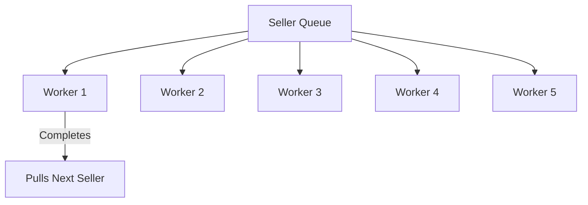

# Scraping Engine & Ingestion Pipeline

## Table of Contents
1. [Overview](#overview)
2. [Dynamic Concurrency Worker Pool](#dynamic-concurrency-worker-pool)
3. [Octoparse API Gateway](#octoparse-api-gateway)
4. [Direct Playwright / Puppeteer Scrapers](#direct-playwright--puppeteer-scrapers)
5. [Real-time Status via Socket.IO](#real-time-status-via-socketio)

---

## Overview
The **Scraping Engine** is the core data ingestion pump of RetailOps. It manages automated data fetching, parsing, and storage from various e-commerce platforms. The platform relies on a dual scraping pipeline: an internal Playwright/Puppeteer scraper and an external Octoparse cloud scraper integration.

---

## Dynamic Concurrency Worker Pool

The pipeline orchestrates runs via a modern **Dynamic Worker Pool** of up to 5 concurrent jobs:

* Rather than sequentially processing items in blocks of 5, the system initiates 5 concurrent workers.
* When **any** single worker finishes its extraction and exports the parsed results, it immediately pulls the next seller from the shared queue, ensuring exactly 5 workers are actively fetching data at all times.
* A `3000ms` stagger prevents duplicate token collisions or rate limiting at initialization.

---

## Octoparse API Gateway
For sellers with cloud scraping enabled, the system connects directly to the Octoparse Enterprise API:
* **Task Status Check**: Polls task completion states.
* **Smart Data Ingestion**: Pulls extracted records using robust backoff recovery on transient Axios network truncations (`stream has been aborted`).

---

## Direct Playwright / Puppeteer Scrapers
For high-frequency localized crawls, the system launches sandboxed headful/headless browsers utilizing:
* **Stealth Plugin**: Bypasses bot-detection firewalls using randomized user agents, viewport sizes, and canvas fingerprints.
* **Smart Selectors**: Falls back dynamically across diverse DOM path lists if e-commerce sites update their product layout.

---

## Real-time Status via Socket.IO
The backend emits scraping logs, errors, and percentage complete structures to the frontend in real-time via Socket.IO. Operational managers can watch progress meters update live inside the **Scrape Tasks** page.
