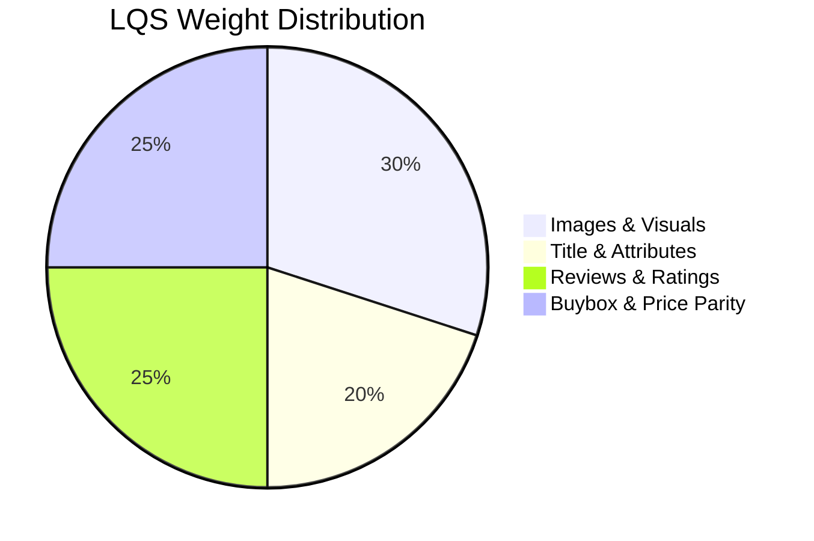

# Listing Quality Scores (LQS)

## Table of Contents
1. [Overview](#overview)
2. [LQS Calculation Algorithm](#lqs-calculation-algorithm)
3. [Component Detail Quality (CDQ) Breakdown](#component-detail-quality-cdq-breakdown)
4. [Data Visualization](#data-visualization)

---

## Overview
The **Listing Quality Score (LQS)** is a proprietary, real-time metric calculated by RetailOps to evaluate how optimized a product listing is across diverse marketplaces. It assesses images, descriptions, reviews, pricing parity, and rating metrics to assign a single quality score out of 100.

---

## LQS Calculation Algorithm

The algorithm evaluates listing data using weighted scoring sectors:

### Weighted Criteria:
1. **Images & Visuals (30%)**: Evaluates image resolution, white background conformity, and counts (optimal count: $\ge 5$ images).
2. **Title & Attributes (20%)**: Title length optimization (80 to 150 characters) and bullet point descriptions completeness.
3. **Reviews & Ratings (25%)**: Star rating metrics ($\ge 4.2$ stars) and volume of customer reviews.
4. **Buybox & Price Parity (25%)**: Penalty applies if the seller has lost the Buybox, or if there is severe pricing divergence across different marketplaces.

---

## Component Detail Quality (CDQ) Breakdown
LQS provides an interactive **Component Detail Quality (CDQ)** scorecard in the UI:
* **Green (80-100)**: Fully optimized listing. No action required.
* **Yellow (50-79)**: Minor issues (e.g., description missing bullet points, image count below 5). Triggers a low-priority audit.
* **Red (<50)**: Critical defects (e.g., lost Buybox, rating below 3.5). Triggers automatic High-priority task generation on the Tasks Board.

---

## Data Visualization
Inside the **ASIN Manager** and **Parent ASIN Report**, the CDQ breakdown is rendered using premium animated donut charts and progress meters, providing clear visibility of where the listing can be optimized to improve sales conversion rates.
