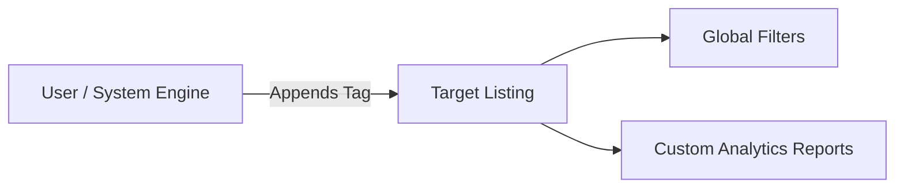

# Listing Tags System

## Table of Contents
1. [Overview](#overview)
2. [Workflow & Interactions](#workflow--interactions)
3. [Key Files](#key-files)
4. [Auto-Tagging Engine](#auto-tagging-engine)
5. [Database Mappings](#database-mappings)

---

## Overview
The **Tags System** provides a flexible meta-layer over ASINs and Jio Codes. It allows operations teams to categorize, organize, and filter listings by brands, collections, seasonal releases, or custom labels without altering the rigid product catalog.

---

## Workflow & Interactions

### 1. Manual Tagging
Inside the ASIN Manager table, users can click on any ASIN's tag column to search, add, or remove custom tags in place.

### 2. Bulk Tags Import
Using the `Bulk Import Modal`, operators can upload a two-column CSV (`ASIN, Tag`) to attach multiple tags to thousands of listings simultaneously.

---

## Key Files
* **Frontend**:
  * [AsinManagerPage.jsx](file:///Users/jenilrupapara/RetailOps_V2.1/retail-ops/src/pages/AsinManagerPage.jsx): Hosts tag filters and the inline tag editor.
* **Backend**:
  * `backend/controllers/tagController.js`: Direct CRUD endpoints for tags.

---

## Auto-Tagging Engine
The system includes an intelligent **Auto-Tagging Background Service**:
* It checks the `ReleaseDate` of listings.
* If the release date is within the last 30 days, it automatically appends a **`New Launch`** tag.
* If a listing has had zero sales or high buybox loss rates for over 60 days, it appends a **`Slow Mover`** tag, which highlights it on operational reports.

---

## Database Mappings

| Table Name | Column Name | Type | Purpose |
| :--- | :--- | :--- | :--- |
| `Tags` | `Id` | `INT` | Primary identity key |
| `Tags` | `Name` | `NVARCHAR(100)` | User-friendly label (e.g., "Summer Collection") |
| `AsinTags` | `AsinId` | `UniqueIdentifier` | M-N mapping key |
| `AsinTags` | `TagId` | `INT` | M-N mapping key |
