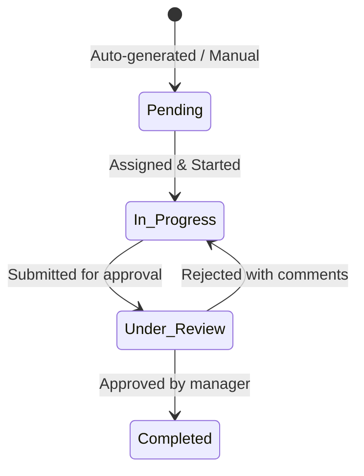

# Task Management & Collaboration Board

## Table of Contents
1. [Overview](#overview)
2. [Workflow](#workflow)
3. [Key Files](#key-files)
4. [Automatic Task Generation Rules](#automatic-task-generation-rules)
5. [Collaboration & Approvals](#collaboration--approvals)

---

## Overview
The **Task Management** module (also known as Actions/Tasks) acts as the operational collaboration engine of RetailOps. It translates automated system alerts (e.g., severe pricing disputes, BSR drops, or lost Buyboxes) into actionable manual tasks with collaborative messaging, attachments, and review pipelines.

---

## Workflow

---

## Key Files
* **Frontend**:
  * [TasksPage.jsx](file:///Users/jenilrupapara/RetailOps_V2.1/retail-ops/src/pages/TasksPage.jsx): Premium Kanban and list views of collaborative workflow cards.
  * [TasksOperationsPage.jsx](file:///Users/jenilrupapara/RetailOps_V2.1/retail-ops/src/pages/TasksOperationsPage.jsx): Flat execution sheets for review and approvals.
* **Backend**:
  * `backend/controllers/actionController.js`: Direct CRUD endpoints for state transitions, assignments, reviews, and uploads.

---

## Automatic Task Generation Rules
While users can create tasks manually, the platform primarily operates on an **automated rules engine**:
1. **Pricing Dispute**: If the actual marketplace price drops below the defined `Minimum Threshold Price` for over 2 consecutive scrape cycles, a High-Priority `Price Dispute Resolution` task is automatically created.
2. **Buybox Loss**: If a brand-exclusive listing loses the Buybox to an unauthorized third-party seller, a `Buybox Loss Investigation` task is created and assigned to the brand's manager.

---

## Collaboration & Approvals
* **Direct Messaging**: Users can send messages and status updates directly within the task detail panel.
* **Review Pipeline**: Operational team members submit their completed tasks for review. Managers (admins) are notified and can either approve the resolution (moving the task to `Completed`) or reject it with detailed comments, returning it to `In Progress`.
