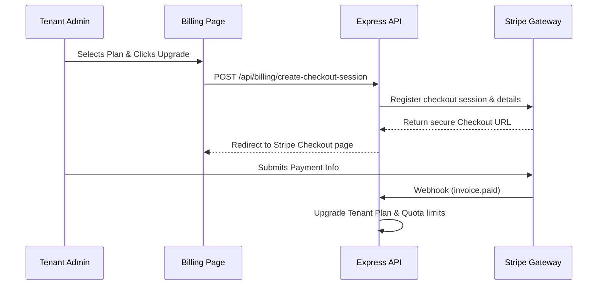

# Billing & Subscription Management

## Table of Contents
1. [Overview](#overview)
2. [Workflow](#workflow)
3. [Key Files](#key-files)
4. [Subscription Plans & Quotas](#subscription-plans--quotas)
5. [Stripe Checkout Integration](#stripe-checkout-integration)

---

## Overview
RetailOps includes a complete self-service **Billing & Subscription** engine. It regulates system access, active tracking limits, and user quotas dynamically based on a tenant's subscription level, powered by Stripe.

---

## Workflow

---

## Key Files
* **Backend**:
  * `backend/controllers/billingController.js`: Manages Stripe Checkout sessions, portal redirections, and webhooks.

---

## Subscription Plans & Quotas

The platform is designed around three distinct tiers:

| Plan Name | Monthly Cost | ASIN Tracking Limit | User Accounts Limit |
| :--- | :--- | :--- | :--- |
| **Starter** | $99 | Up to 100 ASINs | 2 Users |
| **Growth** | $299 | Up to 1,000 ASINs | 5 Users |
| **Enterprise** | $999 | Unlimited | Unlimited |

---

## Stripe Checkout Integration
* **Secure Webhooks**: The system listens to signed Stripe webhooks (`invoice.paid`, `customer.subscription.deleted`) to automatically adjust tenant quotas in real-time.
* **Billing Portal**: Users can securely update card details, view invoices, or cancel their subscriptions through Stripe's hosted Billing Portal.
