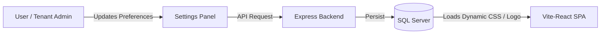

# Profile & Tenant Settings

## Table of Contents
1. [Overview](#overview)
2. [Workflow](#workflow)
3. [Key Files](#key-files)
4. [User Profile Management](#user-profile-management)
5. [Tenant Customization & White-Label Settings](#tenant-customization--white-label-settings)

---

## Overview
The **Profile & Settings** module allows individual users to update their profile information and passwords, while allowing Tenant Admins to configure tenant-wide preferences, white-label branding, and marketplace credentials.

---

## Workflow

---

## Key Files
* **Frontend**:
  * [ProfilePage.jsx](file:///Users/jenilrupapara/RetailOps_V2.1/retail-ops/src/pages/ProfilePage.jsx): Holds forms for updating user details, notification preferences, and changing passwords.
  * [SettingsPage.jsx](file:///Users/jenilrupapara/RetailOps_V2.1/retail-ops/src/pages/SettingsPage.jsx): Admin dashboard for tenant details, API integrations, and white-label customization.
* **Backend**:
  * `backend/controllers/userController.js`: Direct CRUD endpoints for user preferences and profile details.

---

## User Profile Management
Users can customize their account preferences through the profile dashboard:
* **Personal Details**: Update name, email, and contact details.
* **Password Change**: Change account passwords securely with strength verification and mandatory re-authentication.

---

## Tenant Customization & White-Label Settings
Tenant Admins can customize the platform's visual branding under Tenant Settings:
* **Company Brand Name**: Sets the application title and browser tab header dynamically.
* **Custom Logo Upload**: Allows uploading a PNG/SVG logo to replace the default RetailOps branding.
* **Accent Colors**: Dynamically sets the primary, hover, and sidebar colors across the frontend using custom CSS properties.
