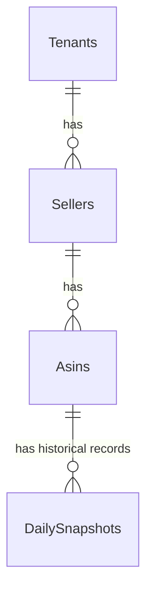

# Database Schema & Indexing Guide

## Table of Contents
1. [Overview](#overview)
2. [Data Tables Schema](#data-tables-schema)
3. [Relationships & ERD](#relationships--erd)
4. [Critical Indexes for Production](#critical-indexes-for-production)

---

## Overview
The platform utilizes **SQL Server (MSSQL)** as its transactional database engine, offering robust connection pooling, transactional integrity, and optimized querying for high-frequency e-commerce listings.

---

## Data Tables Schema

### 1. `Tenants`
Houses client SaaS configurations and branding properties.
* `Id` (UniqueIdentifier, PK)
* `Name` (NVARCHAR(150), Not Null)
* `Domain` (NVARCHAR(200), Null)
* `LogoUrl` (NVARCHAR(500), Null)
* `PrimaryColor` (NVARCHAR(20), Null)

### 2. `Sellers`
Associated marketplace stores.
* `Id` (UniqueIdentifier, PK)
* `TenantId` (UniqueIdentifier, FK -> Tenants.Id)
* `Name` (NVARCHAR(255), Not Null)
* `Marketplace` (NVARCHAR(50), Not Null)
* `OctoparseTaskId` (NVARCHAR(100), Null)
* `Status` (NVARCHAR(20), Default 'Active')

### 3. `Asins`
The core tracked listing entries.
* `Id` (UniqueIdentifier, PK)
* `AsinCode` (NVARCHAR(50), Not Null)
* `SellerId` (UniqueIdentifier, FK -> Sellers.Id)
* `Sku` (NVARCHAR(100), Null)
* `Price` (DECIMAL(18,2), Null)
* `MinThresholdPrice` (DECIMAL(18,2), Null)
* `ReleaseDate` (DATE, Null)
* `LastScrapedAt` (DATETIME, Null)

### 4. `DailySnapshots`
Historical tracking records for ASINs.
* `Id` (BIGINT, PK, Identity)
* `AsinId` (UniqueIdentifier, FK -> Asins.Id)
* `Date` (DATE, Not Null)
* `BuyboxPrice` (DECIMAL(18,2), Null)
* `BSR` (INT, Null)
* `Rating` (DECIMAL(3,2), Null)
* `ReviewCount` (INT, Null)

---

## Relationships & ERD



---

## Critical Indexes for Production

To prevent performance issues during large dataset queries, the following production database indexes are pre-configured:

```sql
-- Fast ASIN Lookups & Filtering
CREATE NONCLUSTERED INDEX IX_Asins_AsinCode_SellerId_LastScrapedAt
ON Asins (AsinCode, SellerId, LastScrapedAt);

-- Fast Daily Snapshot Trend Aggregations
CREATE NONCLUSTERED INDEX IX_DailySnapshots_AsinId_Date
ON DailySnapshots (AsinId, Date)
INCLUDE (BuyboxPrice, BSR, Rating);
```
