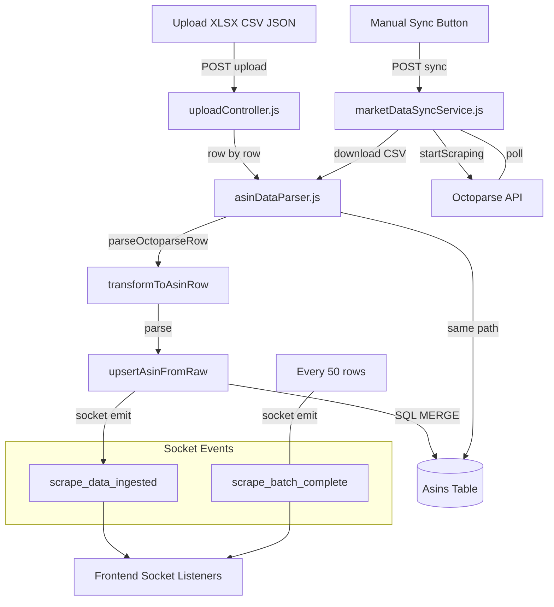
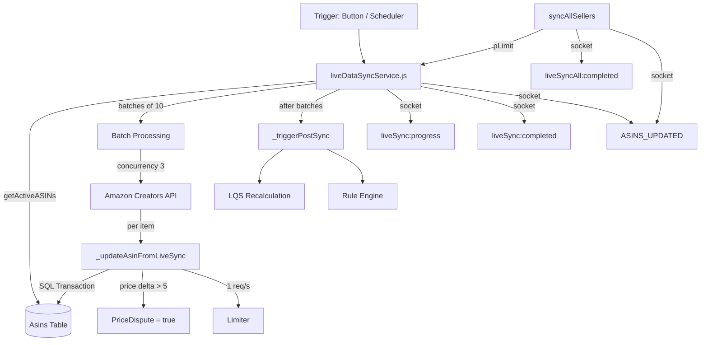
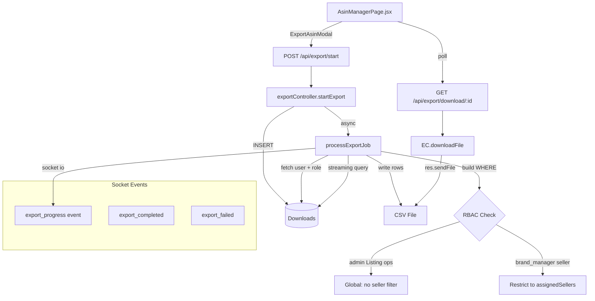
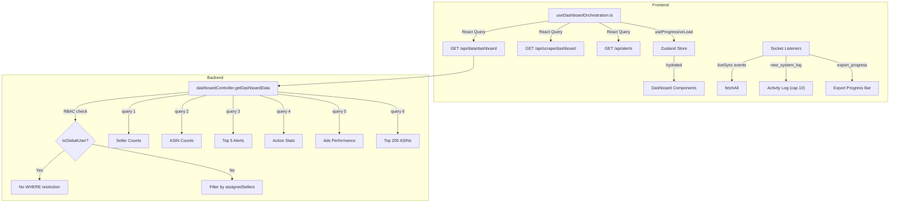
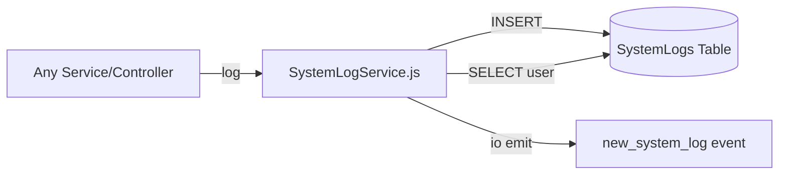
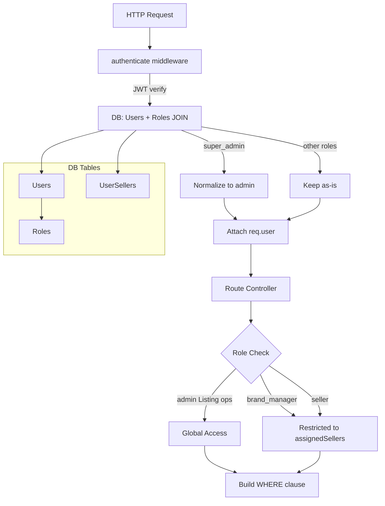
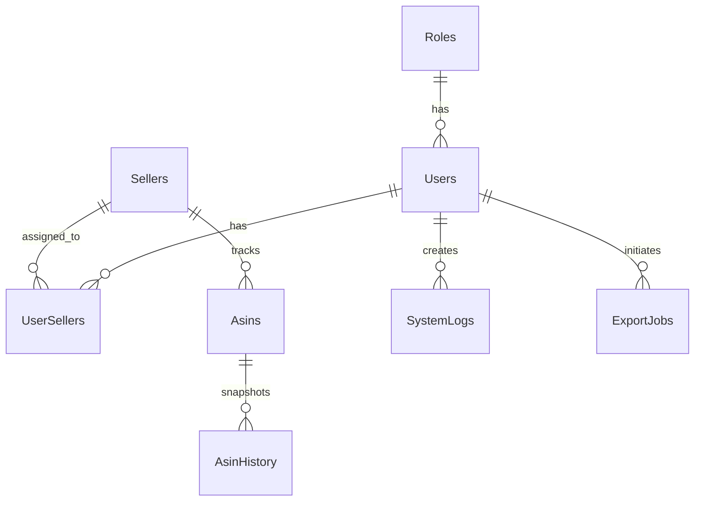

# RetailOps System Audit — Architecture & Data Flow Reference

**Last updated:** 2026-06-19  
**Scope:** ASIN pipeline, Octoparse ingestion, live sync, export system, Socket.IO, dashboard, activity logs, RBAC  
**Tech stack:** Node.js/Express + React 19 + Vite 8 + SQL Server + Socket.IO + Zustand + React Query

---

## Table of Contents

1. [ASIN Data Pipeline](#1-asin-data-pipeline)
2. [Live Sync Architecture](#2-live-sync-architecture)
3. [Export System](#3-export-system)
4. [Socket.IO Event Map](#4-socketio-event-map)
5. [Dashboard Data Flow](#5-dashboard-data-flow)
6. [Activity Logs](#6-activity-logs)
7. [Auth & RBAC Flow](#7-auth--rbac-flow)
8. [Database Schema (Key Tables)](#8-database-schema-key-tables)

---

## 1. ASIN Data Pipeline

### 1.1 Octoparse Upload (Raw File)

```
POST /upload/octoparse  (multer: XLSX/CSV/JSON)
       │
       ▼
uploadController.uploadOctoparseData()
       │
       ├── normalizeHeaders(row)           — lowercase + trim column names
       ├── marketDataSyncService.processBatchResults([row])  — batch of 50
       │        │
       │        ▼
       │   asinDataParser.processBatchResults(rawDataArray, sellerId)
       │        │
       │        ▼
       │   for each row:
       │     parseOctoparseRow(row)        — map raw keys → normalized (aliases)
       │     transformToAsinRow(raw, sellerId)
       │       ├── extractAsin()           — from /dp/ or /p/ URL
       │       ├── parsePrice()            — strip ₹, commas → float
       │       ├── derivePricesFromRawData()  — ASP/MRP fallback + swap logic
       │       ├── parseBSR(), parseReviewCount(), parseRating(), ...
       │       ├── calculateLQS({...})     — from backend/utils/lqs.js
       │       └── returns full 50+ field row object
       │     upsertAsinFromRaw(row, sellerId)
       │       ├── dynamic MERGE SQL (ON AsinCode + SellerId)
       │       ├── emits socket: scrape_data_ingested
       │       └── returns { Id, SellerId, AsinCode }
       │
       └── (after batch of 50):
            emits socket: scrape_batch_complete
```

**Key files:**
- `backend/controllers/uploadController.js` — route handler, row iteration
- `backend/services/asinDataParser.js` — parsing, transformation, upsert, socket emit
- `backend/services/marketDataSyncService.js` — batch orchestration
- `backend/routes/uploadRoutes.js` — route registration

**Socket events emitted:**
- `scrape_data_ingested` — per-ASIN after upsert success (line 465)
- `scrape_batch_complete` — after every 50-row batch (line 498)

```js
// scrape_data_ingested payload (asinDataParser.js:465-471)
io.emit('scrape_data_ingested', {
    asinId: merged.Id,
    sellerId: merged.SellerId,
    asinCode: merged.AsinCode,
    timestamp: new Date()
});

// scrape_batch_complete payload (asinDataParser.js:498-504)
io.emit('scrape_batch_complete', {
    sellerId: sellerId,
    count: updatedAsinCodes.length,
    asinCodes: updatedAsinCodes,
    timestamp: new Date()
});
```

### 1.2 Octoparse API Sync (Automated / Manual Trigger)

```
POST /api/octoparse/sync-all/:sellerId
       │
       ▼
marketDataSyncController.syncSellerAsins()
       │
       ▼
marketDataSyncService.syncSellerAsinsToOctoparse(sellerId, options)
       │
       ├── 1. Read ASINs from DB for this seller
       ├── 2. startScraping(asins, sellerId, taskId)  → Octoparse Enterprise API
       ├── 3. waitForTaskCompletion(taskId, maxWaitMs=300000)
       │         └── Poll every 10s: status ∈ {Completed, Failed, Error, NoData}
       ├── 4. getTaskData(taskId, options)  → download CSV (paginated)
       ├── 5. upsertParsedData(data, sellerId) → parse CSV → processBatchResults()
       │         └── (same asinDataParser.js upsert path as upload)
       ├── 6. markDataAsExported(taskId)
       └── 7. clearTaskData(taskId)
```

**Rate limiting:** Max 4 req/sec via token bucket (`backend/services/marketDataSyncService.js`)  
**Poll timeout:** 5 minutes (`MAX_WAIT_MS = 300000`)  
**Max refill cycles:** 300

### 1.3 Data Flow Diagram



---

## 2. Live Sync Architecture

### 2.1 Overview

Fetches real-time Amazon listing data via the **Creators API** (Amazon SP-API). Runs per-seller or globally across all sellers.

### 2.2 Flow

```
POST /sync/live/:sellerId
       │
       ▼
marketDataSyncController.triggerLiveSync()
       │
       ▼
liveDataSyncService.syncSellerLiveData(sellerId)
       │
       ├── 1. Get all active ASINs (WHERE Status = 'Active')
       ├── 2. Create batches of maxPerRequest: 10
       ├── 3. Process batches with pLimit(concurrency: 3)
       │         │
       │         ▼
       │    for each batch:
       │       POST creatorsapi.amazon/catalog/v1/getItems
       │       │
       │       ▼
       │    for each item in batch response:
       │       _updateAsinFromLiveSync(asinCode, data)
       │         ├── SQL transaction: UPDATE Asins + INSERT AsinHistory
       │         ├── Fields NOT overwritten: HasAplus, AplusContent,
       │         │   AplusModuleCount, RatingBreakdown
       │         ├── Price dispute detection:
       │         │   |uploadedPrice - currentPrice| > 5 AND no deal badge
       │         │   → PriceDispute = true
       │         └── Rate limit: max 1 req/sec
       │
       ├── 4. _triggerPostSync()
       │         ├── LQS recalculation (listingQualityService.js)
       │         └── Rule engine evaluation (rulesetEngineService.js)
       │
       └── 5. Socket emits:
             ├── liveSync:progress (per batch)
             ├── liveSync:completed (per seller)
             └── ASINS_UPDATED { sellerId }
```

### 2.3 Global Sync

```
POST /sync-all/sellers
       │
       ▼
liveDataSyncService.syncAllSellers(options)
       │
       ├── Query all active sellers WITH Amazon ASINs (AsinCode LIKE 'B0%')
       ├── Process sellers with pLimit(concurrency)
       │    ├── 2s delay between sellers
       │    └── Each calls syncSellerLiveData()
       │
       └── Socket emits:
             ├── liveSyncAll:completed { summary }
             └── ASINS_UPDATED { type: 'bulk', sellerCount }
```

### 2.4 Summary Object

```js
// syncAllSellers() summary (liveDataSyncService.js:285-293)
const summary = {
    totalSellers: sellers.length,
    success:     results.filter(r => r.status === 'SUCCESS').length,
    failed:      results.filter(r => r.status === 'FAILED').length,
    skipped:     results.filter(r => r.status === 'SKIPPED').length,
    totalAsinsUpdated: results.reduce((sum, r) => sum + (r.updated || 0), 0),
    duration:    totalDuration,
    completedAt: new Date().toISOString()
};
```

### 2.5 Credential Resolution

| Priority | Source | Fields |
|----------|--------|--------|
| 1 (highest) | `Sellers.LiveSyncClientId` / `LiveSyncClientSecret` | Seller-level override |
| 2 (fallback) | Environment variables `LIVE_SYNC_CLIENT_ID`, `LIVE_SYNC_CLIENT_SECRET`, `LIVE_SYNC_PARTNER_TAG`, `LIVE_SYNC_MARKETPLACE` | Global defaults |

OAuth2 token cached in `_tokens` map, auto-refreshed with 1-minute buffer before expiry.

### 2.6 Flow Diagram



---

## 3. Export System

### 3.1 Overview

Background job pipeline: starts an export job, processes it asynchronously, then serves the generated CSV file.

### 3.2 End-to-End Flow

```
Frontend                              Backend
   │                                     │
   │  POST /api/export/start             │
   │  { sellerIds, fields, filters... }  │
   │────────────────────────────────►    │
   │                                     │
   │            startExport()            │
   │              ├── Validate params    │
   │              ├── INSERT Downloads   │
   │              │   (status=processing)│
   │              ├── Return { id,name }│
   │◄────────────────────────────────────│
   │                                     │
   │            processExportJob()       │  ← async, non-blocking
   │              ├── Fetch user + role  │
   │              │   for RBAC          │
   │              ├── Build WHERE clause │
   │              │   (seller filters +  │
   │              │    advanced filters) │
   │              ├── Execute query with │
   │              │   streaming + pag-   │
   │              │   ination (500/ batch)│
   │              ├── Write CSV rows     │
   │              │   to file            │
   │              └── Update status      │
   │                  → 'completed'      │
   │                                     │
   │  Poll: GET /export/download/:id     │
   │────────────────────────────────►    │
   │              downloadFile()         │
   │              (res.sendFile)         │
   │◄────────────────────────────────────│
   │         CSV file downloaded         │
```

### 3.3 RBAC WHERE Clause Construction

```js
// exportController.js:209-220
const roleName = user?.role || '';
const isGlobalUser = ['admin', 'operational_manager', 'Listing Manager'].includes(roleName);

if (!isGlobalUser) {
    const assignedIds = user?.assignedSellers || [];
    if (assignedIds.length === 0) {
        whereClause += ' AND 1=0';   // No access → no rows
    } else {
        whereClause += ` AND a.SellerId IN (${assignedIds.map(id => `'${id}'`).join(',')})`;
    }
}
```

**Role normalization** (same pattern in primary + GMS export paths):
```js
// exportController.js:148, 1188
role: u.RoleName === 'super_admin' ? 'admin' : u.RoleName,
```

### 3.4 Advanced Filters

All filter params from `AsinManagerPage` UI are destructured at line 164–202:

| Filter | SQL | Type |
|--------|-----|------|
| `search` | `AND (a.Title LIKE ... OR a.AsinCode LIKE ...)` | string |
| `status` | `AND a.Status = @status` | string |
| `category` | `AND a.Category = @category` | string |
| `brand` | `AND a.Brand = @brand` | string |
| `minPrice` / `maxPrice` | `AND a.CurrentPrice BETWEEN @min AND @max` | decimal |
| `minBSR` / `maxBSR` | `AND a.BSR BETWEEN @min AND @max` | int |
| `minLQS` / `maxLQS` | `AND a.LQS BETWEEN @min AND @max` | decimal |
| `buyBoxWin` | `AND a.BuyBoxWin = @buyBoxWin` | bit |
| `hasAplus` | `AND a.HasAplus = @hasAplus` | bit |
| `priceDispute` | `AND a.PriceDispute = @priceDispute` | bit |
| `asinIds[]` | `AND a.Id IN (...)` | string[] |

### 3.5 SQL Field Mapping

42 fields mapped at `exportController.js:376-426`:

```js
const sqlFieldMapping = {
    'asinCode':            'a.AsinCode',
    'parentAsin':          'a.ParentAsin',
    'sku':                 'a.Sku',
    'title':               'a.Title',
    'brand':               'a.Brand',
    'category':            'a.Category',
    'status':              'a.Status',
    'uploadedPrice':       'a.UploadedPrice',
    'currentPrice':        'a.CurrentPrice',
    'mrp':                 'a.Mrp',
    'dealBadge':           'a.DealBadge',
    'priceDispute':        'a.PriceDispute',
    'bsr':                 'a.BSR',
    'totalOrders':         '(SELECT SUM(...) FROM AdsPerformance WHERE Asin = a.AsinCode)',
    'subBsr':              'a.SubBsr',
    'rating':              'a.Rating',
    'reviewCount':         'a.ReviewCount',
    'lqs':                 'a.LQS',
    'titleScore':          'a.TitleScore',
    'bulletScore':         'a.BulletScore',
    'imageScore':          'a.ImageScore',
    'descriptionScore':    'a.DescriptionScore',
    'buyBoxWin':           'a.BuyBoxWin',
    'soldBy':              'a.SoldBy',
    'hasAplus':            'a.HasAplus',
    'imagesCount':         'a.ImagesCount',
    'bulletPoints':        'a.BulletPoints',
    'lastScraped':         'a.LastScrapedAt',
    'createdAt':           'a.CreatedAt',
    'tags':                'a.Tags',
    'sellerName':          's.Name',
    // ... and more
};
```

### 3.6 Streaming Query + CSV Generation

```
selectRequest.stream = true;
selectRequest.on('row', row => { csvWriter.write(row) });
// Pagination: OFFSET ... FETCH NEXT 500 ROWS ONLY
// Emits export_progress socket events incrementally
```

### 3.7 Socket Events

```js
// Progress (SocketService.emitExportUpdate → exportController.js:853)
io.emit('export_progress', { downloadId, status, progress, total });

// Completed (exportController.js:812-818)
io.to(`user_${userId}`).emit('export_completed', { downloadId, fileName, rowCount, fileSize });

// Failed (exportController.js:828-832)
io.to(`user_${userId}`).emit('export_failed', { downloadId, error });
```

### 3.8 Diagram



---

## 4. Socket.IO Event Map

### 4.1 Service Setup

**Backend** (`backend/services/socketService.js`):
```js
// Singleton pattern
let io;
module.exports = {
    init: (socketIoInstance) => { io = socketIoInstance; },
    getIo: () => io,
    emitToUser: (userId, event, data) => io.to(userId.toString()).emit(event, data),
    emitExportUpdate: (downloadId, data) => io.emit('export_progress', { downloadId, ...data })
};
```

**Server init** (`backend/server.js`):
```js
const io = new Server(httpServer, { cors: { ... } });
io.on('connection', (socket) => {
    socket.on('join', (userId) => socket.join(userId));
});
require('./services/socketService').init(io);
```

**Frontend** (`src/contexts/SocketContext.jsx`):
- Creates `io(socketUrl, { transports: ['websocket'], reconnection: true })`
- On auth: emits `join` with `user._id || user.id`
- Exposes `socket` via `useSocket()` hook

### 4.2 Complete Event Table

| Event | Source File | Line | Trigger | Payload |
|-------|------------|------|---------|---------|
| `scrape_data_ingested` | `asinDataParser.js` | 465 | Per-ASIN upsert success | `{ asinId, sellerId, asinCode, timestamp }` |
| `scrape_batch_complete` | `asinDataParser.js` | 498 | After 50-row batch | `{ sellerId, count, asinCodes[], timestamp }` |
| `liveSync:progress` | `liveDataSyncService.js` | 130 | Per-batch progress | `{ sellerId, progress, processed, total }` |
| `liveSync:completed` | `liveDataSyncService.js` | 172 | Seller sync done | `{ sellerId, totalAsins, updatedAsins, failedAsins, duration }` |
| `liveSyncAll:completed` | `liveDataSyncService.js` | 303 | Global sync done | `{ totalSellers, success, failed, skipped, totalAsinsUpdated, duration, completedAt }` |
| `ASINS_UPDATED` | `liveDataSyncService.js` | 181 | After live sync | `{ sellerId }` or `{ type:'bulk', sellerCount }` |
| `new_system_log` | `SystemLogService.js` | 47 | Any system log created | `{ Id, Type, EntityType, EntityId, EntityTitle, UserId, user, Description, Metadata, CreatedAt }` |
| `export_progress` | `socketService.js` (via `exportController.js`) | 24 | Export job progress | `{ downloadId, status, progress, total }` |
| `export_completed` | `exportController.js` | 812 | Export job done | `{ downloadId, fileName, rowCount, fileSize }` |
| `export_failed` | `exportController.js` | 828 | Export job error | `{ downloadId, error }` |
| `receive_message` | `SocketContext.jsx` | 48 | Chat message | `{ sender, content, ... }` |
| `incoming_call` | `SocketContext.jsx` | 54 | Voice/video call | `{ callerId, type }` |

### 4.3 Frontend Listener Map

| Page / Hook | File | Event(s) | Action |
|-------------|------|----------|--------|
| ASIN Manager | `AsinManagerPage.jsx:1258-1281` | `ASINS_UPDATED`, `liveSync:completed`, `liveSyncAll:completed` | `loadData(pagination.page)` + `message.success()` toast |
| Activity Log | `ActivityLog.jsx:33-59` | `new_system_log` | Prepends to log list (cap 500, debounce 300ms) + `message.info()` |
| Dashboard | `useDashboardData.ts:165-189` | `new_system_log` | Prepends to activity log list (cap 10) |
| Dashboard | `useDashboardData.ts` | `scrape:progress`, `liveSync:progress`, `liveSync:completed`, `export_progress`, `sync:progress/completed/error` | Updates `scanningState`, calls `fetchAll()` |
| (global) | `SocketContext.jsx` | `receive_message`, `incoming_call` | Browser notifications |

---

## 5. Dashboard Data Flow

### 5.1 Backend Endpoints

| Endpoint | Controller | Purpose |
|----------|-----------|---------|
| `GET /api/data/dashboard` | `dashboardController.getDashboardData` | Main dashboard payload |
| `GET /api/scrape/dashboard` | `scrapeController.getScrapeDashboardData` | ASIN summary stats |
| `GET /api/alerts` | alerts controller | Alert list |

### 5.2 Parallel Queries

`getDashboardData()` executes these in series (not parallel) within a single request:

1. **Seller counts** — `COUNT(*)`, `SUM(IsActive)` from Sellers
2. **ASIN counts** — Total, Active, OutOfStock, NewThisMonth, PortfolioValue
3. **Top 5 alerts** — `SELECT TOP 5 ... FROM Alerts ORDER BY CreatedAt DESC`
4. **User action stats** — `SELECT Status, COUNT(*) FROM Actions WHERE AssignedTo = @userId`
5. **Team action stats** — (global users only) `SELECT Status, COUNT(*) FROM Actions`
6. **Ads performance** — JOIN Asins + AdsPerformance for date range
7. **Marketplace distribution** — GROUP BY SellerId → map to Marketplace
8. **Top 200 ASINs** — by total orders (JOIN Asins + Sellers + AdsPerformance)

### 5.3 RBAC Filtering

```js
// dashboardController.js:32-33
const roleName = req.user?.role?.name || req.user?.role;
const isGlobalUser = ['admin', 'operational_manager'].includes(roleName);

// When global + no specific seller → wide filters (no WHERE restriction)
const useWideFilters = isGlobalUser && (!sellerId || sellerId === 'all');
let sellerFilter = useWideFilters ? '' : 'WHERE Id IN (...ids...)';
let asinFilter   = useWideFilters ? '' : 'WHERE SellerId IN (...ids...)';
let alertFilter  = useWideFilters ? '' : 'WHERE SellerId IN (...ids...)';
```

### 5.4 Frontend Data Flow

```
useDashboardOrchestration.ts
       │
       ├── useQuery('/api/scrape/dashboard')    → ASIN KPI stats
       ├── useQuery('/api/data/dashboard')      → full dashboard
       └── useQuery('/api/alerts')              → alerts list
              │
              ▼
       useProgressiveLoad (per-segment delays 200-500ms)
              │
              ▼
       Zustand store (via loaderReceive)
              │
              ▼
       React components render each segment
```

**Real-time updates:**
- `socket.on('liveSync:completed' / 'liveSyncAll:completed')` → `fetchAll()`
- `socket.on('new_system_log')` → prepend to activity log (max 10)
- `socket.on('export_progress')` → update export modal progress bar

### 5.5 Diagram



---

## 6. Activity Logs

### 6.1 Backend — Log Creation



### 6.2 Payload Enrichment

```js
// SystemLogService.js:47-58
io.emit('new_system_log', {
    Id:          id,
    Type:        type,          // e.g. 'asin:parsed', 'scrape:completed', 'live_sync:completed'
    EntityType:  entityType,    // e.g. 'Asin', 'Seller'
    EntityId:    entityId,
    EntityTitle: entityTitle,
    UserId:      userId,
    user: {                     // fetched from Users table
        Id,
        FirstName,
        LastName,
        Email
    },
    Description: description,
    Metadata:    metadata       // JSON string or object
        ? (typeof metadata === 'string' ? metadata : JSON.stringify(metadata))
        : null,
    CreatedAt:   new Date().toISOString()
});
```

### 6.3 Log Types Emitted

| Type | Trigger | Source |
|------|---------|--------|
| `asin:parsed` | Octoparse data ingested | `uploadController.js` / `marketDataSyncService.js` |
| `scrape:completed` | Octoparse sync complete | `marketDataSyncService.js` |
| `live_sync:completed` | Live sync complete | `liveDataSyncService.js` |
| `export:completed` | Export job complete | `exportController.js` |
| `user:login` | User authentication | `authController.js` |

### 6.4 Frontend — ActivityLog.jsx

```
socket.on('new_system_log', handleNewSystemLog)
       │
       ├── Normalize: handle both camelCase and PascalCase fields
       ├── Prepend to log list (unshift)
       ├── Cap at 500 items
       ├── Debounce at 300ms
       └── message.info() toast notification
```

**Color mapping:** `system`→purple, `scrape`→blue, `live_sync`→teal, `user`→orange, `export`→green, `error`→red, `warning`→yellow

### 6.5 Deduplication

`SystemLogService` uses `asyncLocalStorage` with a `logged` flag per request lifecycle:
```js
asyncLocalStorage.getStore().logged = true;
```
If already logged, the entry is silently skipped to prevent duplicate emits from middleware re-entrance.

---

## 7. Auth & RBAC Flow

### 7.1 Authentication Middleware

```
Request → Authorization: Bearer <JWT>
       │
       ▼
auth.authenticate()
       │
       ├── 1. Extract JWT from header
       ├── 2. Verify JWT (jsonwebtoken)
       ├── 3. Lookup user in DB:
       │      SELECT U.*, R.Name as RoleName, R.DisplayName as RoleDisplayName
       │      FROM Users U JOIN Roles R ON U.RoleId = R.Id
       │      WHERE U.Id = @userId
       ├── 4. Fetch assigned sellers:
       │      SELECT SellerId FROM UserSellers WHERE UserId = @userId
       ├── 5. Attach to request:
       │      req.userId = userData.Id
       │      req.user = {
       │        ...userData,
       │        _id: userData.Id,
       │        role: {
       │          Name: userData.RoleName === 'super_admin' ? 'admin' : userData.RoleName,
       │          name: userData.RoleName === 'super_admin' ? 'admin' : userData.RoleName,
       │          DisplayName: userData.RoleDisplayName
       │        },
       │        assignedSellers: [...],
       │        permissions: [...],
       │        hasPermission: async (perm) => permissions.includes(perm),
       │        hasAnyPermission: async (perms) => perms.some(p => permissions.includes(p))
       │      }
       └── 6. next()
```

**Role normalization** occurs at `backend/middleware/auth.js:130-131`:
```js
Name: userData.RoleName === 'super_admin' ? 'admin' : userData.RoleName,
name: userData.RoleName === 'super_admin' ? 'admin' : userData.RoleName,
```

### 7.2 RBAC Pattern Across Controllers

| Controller | isGlobalUser Roles | Seller Restriction Method |
|-----------|-------------------|--------------------------|
| `asinController.js` | `admin`, `operational_manager`, `Listing Manager` | `WHERE a.SellerId IN (...)` (string-interpolated IDs) |
| `exportController.js` | `admin`, `operational_manager`, `Listing Manager` | `WHERE a.SellerId IN (...)` or `AND 1=0` |
| `dashboardController.js` | `admin`, `operational_manager` | `WHERE Id IN (...)` or empty string (no restriction) |

**Important:** `dashboardController.js` does NOT include `'Listing Manager'` in its global roles, unlike `asinController.js` and `exportController.js`. This means Listing Manager users see restricted dashboard data.

### 7.3 `super_admin` Normalization Points

| Location | File | Line |
|----------|------|------|
| Auth middleware | `backend/middleware/auth.js` | 130-131 |
| Export (primary) | `backend/controllers/exportController.js` | 148 |
| Export (GMS) | `backend/controllers/exportController.js` | 1188 |

### 7.4 Role Hierarchy

```js
// backend/middleware/auth.js
exports.getRoleLevel = (userRoleName) => {
    if (userRoleName === 'super_admin') return 100;
    if (userRoleName === 'admin')       return 90;
    if (userRoleName === 'brand_manager') return 70;
    if (userRoleName === 'seller')      return 50;
    if (userRoleName === 'viewer')      return 30;
    return 0;
};
```

### 7.5 Flow Diagram



---

## 8. Database Schema (Key Tables)

### 8.1 `Asins`

The primary listing tracking table.

| Column | Type | Notes |
|--------|------|-------|
| `Id` | VARCHAR(24) PK | Generated by `generateId()` |
| `AsinCode` | NVARCHAR(20) | Amazon ASIN (B0...) or Jio code |
| `ParentAsin` | NVARCHAR(20) | Parent ASIN for variations |
| `Sku` | NVARCHAR(255) | SKU |
| `Title` | NVARCHAR(MAX) | Product title |
| `SellerId` | VARCHAR(24) FK → Sellers | |
| `UserId` | VARCHAR(24) FK → Users | Creator |
| `Status` | NVARCHAR(50) | Active, Inactive, Scraping, Error |
| `ScrapeStatus` | NVARCHAR(50) | COMPLETED, FAILED, SCRAPING, PENDING |
| `Category` | NVARCHAR(255) | |
| `Brand` | NVARCHAR(255) | |
| `UploadedPrice` | DECIMAL(18,2) | Price at upload time |
| `CurrentPrice` | DECIMAL(18,2) | Latest fetched price |
| `Mrp` | DECIMAL(18,2) | Maximum retail price |
| `DealBadge` | NVARCHAR(100) | Deal/coupon badge text |
| `PriceType` | NVARCHAR(50) | |
| `DiscountPercentage` | DECIMAL(5,2) | |
| `SecondAsp` | DECIMAL(18,2) | Alternative selling price |
| `AspDifference` | DECIMAL(18,2) | Difference between price sources |
| `PriceDispute` | BIT DEFAULT 0 | Flagged when price delta > 5 |
| `PriceDisputeReason` | NVARCHAR(MAX) | |
| `BSR` | INT | Best sellers rank |
| `BsrTrend` | NVARCHAR(20) | up/down/stable |
| `TotalOrders` | INT | (from AdsPerformance subquery in export) |
| `SubBsr` | INT | Subcategory BSR |
| `SubBSRs` | NVARCHAR(MAX) | JSON of subcategory BSRs |
| `CategoryBSR` | INT | |
| `Rating` | DECIMAL(3,2) | e.g. 4.50 |
| `RatingTrend` | NVARCHAR(20) | |
| `ReviewCount` | INT | |
| `Percentage` | DECIMAL(18,2) | |
| `Lqs` | DECIMAL(5,2) | Listing quality score 0-100 |
| `TitleScore` | DECIMAL(5,2) | LQS component |
| `BulletScore` | DECIMAL(5,2) | LQS component |
| `ImageScore` | DECIMAL(5,2) | LQS component |
| `DescriptionScore` | DECIMAL(5,2) | LQS component |
| `FbaFee` | DECIMAL(18,2) | |
| `ReferralFee` | DECIMAL(18,2) | |
| `OtherFee` | DECIMAL(18,2) | |
| `TotalFee` | DECIMAL(18,2) | |
| `ImagesCount` | INT | |
| `VideoCount` | INT | |
| `ImageUrl` | NVARCHAR(MAX) | Main image URL |
| `Images` | NVARCHAR(MAX) | JSON array of image URLs |
| `BulletPoints` | NVARCHAR(MAX) | JSON array |
| `BulletPointsText` | NVARCHAR(MAX) | Plain text bullets |
| `ListingQuality` | NVARCHAR(50) | |
| `HasAplus` | BIT | A+ content present |
| `HasEbc` | BIT | Enhanced brand content |
| `AplusAbsentSince` | DATETIME2 | |
| `AplusPresentSince` | DATETIME2 | |
| `Tags` | NVARCHAR(MAX) | JSON array |
| `BuyBoxWin` | BIT | Currently winning buy box |
| `BuyBoxStatus` | NVARCHAR(100) | |
| `BuyBoxSellerId` | NVARCHAR(100) | |
| `SoldBy` | NVARCHAR(255) | |
| `SoldBySec` | NVARCHAR(255) | Secondary seller |
| `AllOffers` | NVARCHAR(MAX) | JSON |
| `BuyBoxes` | NVARCHAR(MAX) | JSON |
| `AvailabilityStatus` | NVARCHAR(50) | |
| `StockLevel` | INT | |
| `LastScrapedAt` | DATETIME2 | Last Octoparse scrape |
| `LastLiveSyncAt` | DATETIME | Last live sync |
| `LastSyncSource` | NVARCHAR(50) | 'OCTOPARSE' or 'LIVE' |
| `CreatedAt` | DATETIME2 DEFAULT GETDATE() | |
| `UpdatedAt` | DATETIME2 DEFAULT GETDATE() | |

Indexes: `IX_Asins_AsinCode_SellerId`, `IX_Asins_SellerId`, `IX_Asins_LastLiveSyncAt`

### 8.2 `Sellers`

| Column | Type | Notes |
|--------|------|-------|
| `Id` | VARCHAR(24) PK | |
| `Name` | NVARCHAR(255) | |
| `Email` | NVARCHAR(255) | |
| `Phone` | NVARCHAR(50) | |
| `OctoparseId` | NVARCHAR(255) | Octoparse task ID |
| `Marketplace` | NVARCHAR(100) | e.g. `www.amazon.in` |
| `ScrapeLimit` | INT DEFAULT 500 | |
| `ScrapeUsed` | INT DEFAULT 0 | |
| `LiveSyncClientId` | NVARCHAR(255) | Seller-level Amazon API credentials |
| `LiveSyncClientSecret` | NVARCHAR(500) | |
| `PartnerTag` | NVARCHAR(100) | |
| `LiveSyncEnabled` | BIT DEFAULT 0 | |
| `IsActive` | BIT DEFAULT 1 | |
| `LastScrapedAt` | DATETIME2 | |
| `LastLiveSyncAt` | DATETIME | |
| `CreatedAt` | DATETIME2 | |
| `UpdatedAt` | DATETIME2 | |

### 8.3 `SystemLogs`

| Column | Type | Notes |
|--------|------|-------|
| `Id` | VARCHAR(24) PK | |
| `Type` | NVARCHAR(50) | `asin:parsed`, `scrape:completed`, `live_sync:completed`, `export:completed`, `user:login` |
| `EntityType` | NVARCHAR(100) | `Asin`, `Seller`, `User` |
| `EntityId` | VARCHAR(24) | FK reference |
| `EntityTitle` | NVARCHAR(255) | Human-readable entity name |
| `UserId` | VARCHAR(24) FK → Users | |
| `Description` | NVARCHAR(MAX) | Free-text log message |
| `Metadata` | NVARCHAR(MAX) | JSON payload |
| `CreatedAt` | DATETIME2 DEFAULT GETDATE() | |

Indexes: `IX_SystemLogs_CreatedAt DESC`, `IX_SystemLogs_UserId`

### 8.4 `ExportJobs` / `Downloads`

| Column | Type | Notes |
|--------|------|-------|
| `Id` | VARCHAR(24) PK | |
| `UserId` | VARCHAR(24) FK → Users | |
| `Type` | NVARCHAR(50) | `asin_export`, `gms_export` |
| `Status` | NVARCHAR(50) | `pending`, `processing`, `completed`, `failed` |
| `Progress` | INT DEFAULT 0 | 0-100 |
| `Total` | INT DEFAULT 0 | Total rows to export |
| `FileName` | NVARCHAR(500) | Display filename |
| `FilePath` | NVARCHAR(1000) | Server path (may be stale) |
| `Filters` | NVARCHAR(MAX) | JSON of export filters |
| `Fields` | NVARCHAR(MAX) | JSON of requested fields |
| `ErrorMessage` | NVARCHAR(MAX) | Error details if failed |
| `CompletedAt` | DATETIME2 | |
| `CreatedAt` | DATETIME2 DEFAULT GETDATE() | |

### 8.5 `AsinHistory`

| Column | Type | Notes |
|--------|------|-------|
| `Id` | VARCHAR(24) PK | |
| `AsinId` | VARCHAR(24) FK → Asins | |
| `SellerId` | VARCHAR(24) FK → Sellers | |
| `Type` | NVARCHAR(50) | `price_check`, `live_sync` |
| `Source` | NVARCHAR(50) | `LIVE`, `OCTOPARSE` |
| `Snapshot` | NVARCHAR(MAX) | JSON of full ASIN state at that time |
| `Status` | NVARCHAR(50) | |
| `UploadedPrice` | DECIMAL(18,2) | |
| `CurrentPrice` | DECIMAL(18,2) | |
| `Mrp` | DECIMAL(18,2) | |
| `Bsr` | INT | |
| `Rating` | DECIMAL(3,2) | |
| `ReviewCount` | INT | |
| `Lqs` | DECIMAL(5,2) | |
| `Metadata` | NVARCHAR(MAX) | JSON |
| `CreatedAt` | DATETIME2 DEFAULT GETDATE() | |

### 8.6 `Users` (relevant columns)

| Column | Type | Notes |
|--------|------|-------|
| `Id` | VARCHAR(24) PK | |
| `FirstName` | NVARCHAR(100) | |
| `LastName` | NVARCHAR(100) | |
| `Email` | NVARCHAR(255) | |
| `RoleId` | VARCHAR(24) FK → Roles | |
| `assignedSellers` | NVARCHAR(MAX) | JSON array of seller IDs |

### 8.7 `UserSellers`

| Column | Type | Notes |
|--------|------|-------|
| `UserId` | VARCHAR(24) FK → Users | |
| `SellerId` | VARCHAR(24) FK → Sellers | Junction table for many-to-many |

### 8.8 Entity Relationship (Simplified)



---

## Index

| File | Purpose |
|------|---------|
| `backend/services/asinDataParser.js` | Octoparse CSV/XLSX parse, transform, upsert, socket emit |
| `backend/services/marketDataSyncService.js` | Octoparse API orchestration, polling, rate limiting |
| `backend/services/liveDataSyncService.js` | Amazon Creators API live sync, price dispute, post-sync |
| `backend/services/socketService.js` | Socket.IO singleton wrapper |
| `backend/services/SystemLogService.js` | System log creation + socket emit |
| `backend/middleware/auth.js` | JWT auth, role normalization, seller assignment |
| `backend/controllers/exportController.js` | Export pipeline: start, process, download |
| `backend/controllers/dashboardController.js` | Dashboard data aggregation |
| `backend/controllers/uploadController.js` | Raw file upload handler |
| `backend/controllers/marketDataSyncController.js` | Sync trigger endpoints |
| `backend/controllers/asinController.js` | ASIN CRUD, sort mapping |
| `backend/database/db.js` | Pool config, generateId, executeWithRetry |
| `src/contexts/SocketContext.jsx` | Frontend socket connection + auth join |
| `src/pages/AsinManagerPage.jsx` | Main ASIN table, socket listeners, export trigger |
| `src/pages/ActivityLog.jsx` | Activity log page, new_system_log listener |
| `src/hooks/useDashboardData.ts` | Dashboard data fetching + socket listeners |
| `src/hooks/useDashboardOrchestration.ts` | React Query orchestration, progressive loading |
| `src/components/asins/ExportAsinModal.jsx` | Export UI modal |
